# Data Structures & Algorithms — Deep Dive Roadmap

We'll go from fundamentals → core data structures → algorithmic techniques → advanced structures → patterns → interview problems.

*(Code examples are in JavaScript for consistency with the other notes in this workspace, but the concepts are language-agnostic.)*

---

## 1. Complexity Analysis

**Definition:** algorithmic complexity analysis measures how an algorithm's resource usage (time or memory) grows as a function of input size `n`, independent of any specific hardware — the tool for comparing algorithms and predicting how they'll behave at scale before ever running them.

**Big-O, Big-Theta, Big-Omega — Definition:**
- **Big-O (O)** — an **upper bound** on growth rate ("this algorithm takes *at most* roughly this long") — the one used almost universally in practice, since it captures worst-case behavior.
- **Big-Omega (Ω)** — a **lower bound** ("at least roughly this long").
- **Big-Theta (Θ)** — a **tight bound**, when the upper and lower bounds match (the algorithm's growth rate is *exactly* this, not just bounded by it).

**Time complexity vs space complexity — Definition:** **time complexity** measures how the number of operations grows with `n`; **space complexity** measures how much additional memory (beyond the input itself) the algorithm needs — the two are often in tension (an algorithm can trade extra memory for less time, or vice versa), and problems frequently specify constraints on both.

**Best, average, worst case — Definition:** the same algorithm can have different complexities depending on the input — e.g. linear search is O(1) best case (the target is first), O(n) worst case (the target is last or absent), O(n) average case — Big-O in casual usage almost always refers to the **worst case** unless stated otherwise.

**Amortized analysis — Definition:** measures the *average* cost per operation over a worst-case **sequence** of operations, even when individual operations occasionally cost much more than others — e.g. a dynamic array's `push` is O(1) amortized: most pushes are O(1), but occasionally one triggers an O(n) resize, and spreading that occasional cost across all the cheap pushes that preceded it averages out to O(1) per push overall.

**Common complexity classes (fastest to slowest growth):**

```
O(1)        constant     — array index access, hash map lookup
O(log n)    logarithmic  — binary search
O(n)        linear       — single loop over input
O(n log n)  linearithmic — efficient sorting (merge sort, heap sort)
O(n²)       quadratic    — nested loops over input (naive pair comparison)
O(2ⁿ)       exponential  — naive recursive subset generation
O(n!)       factorial    — brute-force permutations
```

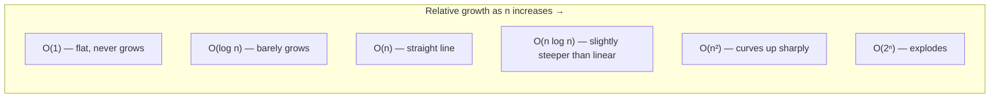
*Ranked from best to worst — at n=1,000, O(log n) is ~10 operations, O(n) is 1,000, O(n log n) is ~10,000, O(n²) is 1,000,000, and O(2ⁿ) is astronomically larger than the number of atoms in the observable universe.*

**Analyzing recursive complexity (brief)** — a recursive algorithm's complexity is expressed as a **recurrence relation** (e.g. `T(n) = 2T(n/2) + O(n)` for merge sort), solvable via the Master Theorem (section 12) or by drawing out the recursion tree and summing work per level.

**Practice problems:**

```js
// 1. Two Sum — brute force O(n²) vs hash map O(n) (see section 5 for the optimal version)
function twoSumBrute(nums, target) {
  for (let i = 0; i < nums.length; i++)
    for (let j = i + 1; j < nums.length; j++)
      if (nums[i] + nums[j] === target) return [i, j];
  return null;
}

// 2. Contains Duplicate — O(n²) nested-loop vs O(n) with a Set
function containsDuplicate(nums) {
  const seen = new Set();
  for (const n of nums) {
    if (seen.has(n)) return true; // O(1) average lookup
    seen.add(n);
  }
  return false;
}

// 3. Fibonacci — naive O(2ⁿ) recursion vs O(n) memoized (illustrates amortized/overlapping-subproblem savings)
function fibNaive(n) { return n <= 1 ? n : fibNaive(n - 1) + fibNaive(n - 2); }
function fibFast(n, memo = {}) {
  if (n <= 1) return n;
  if (n in memo) return memo[n];
  return (memo[n] = fibFast(n - 1, memo) + fibFast(n - 2, memo));
}

// 4. Is array sorted? — best case O(1) (first pair out of order), worst case O(n) (fully sorted)
function isSorted(arr) {
  for (let i = 1; i < arr.length; i++) if (arr[i] < arr[i - 1]) return false;
  return true;
}

// 5. Count pairs with a given difference — O(n²) brute force vs O(n) with a hash set
function countPairsWithDiff(nums, k) {
  const set = new Set(nums);
  let count = 0;
  for (const n of nums) if (set.has(n + k)) count++;
  return count;
}
```

---

## 2. Arrays & Strings

**Array — Definition:** a fixed-layout, contiguous block of memory holding elements of the same type, indexed by position — because elements are contiguous and equally sized, accessing any index is **O(1)**, computed directly as `base_address + index × element_size`, without needing to traverse the structure.

**Static vs dynamic arrays — Definition:** a **static array** has a fixed size, set at creation, that cannot grow; a **dynamic array** (JS's `Array`, Python's `list`) automatically reallocates a larger underlying buffer (typically doubling in size) once it runs out of room — giving `push` its O(1) amortized cost (section 1) despite occasional O(n) resize operations underneath.

**Common array operations & complexity:**

```
Access by index:     O(1)
Search (unsorted):   O(n)
Insert/delete at end:    O(1) amortized
Insert/delete at start/middle: O(n) — every subsequent element must shift
```

**Two-pointer technique — Definition:** using two index variables that traverse an array (from either end inward, or both moving forward at different speeds) to solve a problem in a single pass instead of nested loops — commonly reduces an O(n²) brute-force approach to O(n).

```js
// two sum on a SORTED array
function twoSumSorted(arr, target) {
  let left = 0, right = arr.length - 1;
  while (left < right) {
    const sum = arr[left] + arr[right];
    if (sum === target) return [left, right];
    sum < target ? left++ : right--;
  }
  return null;
}
```

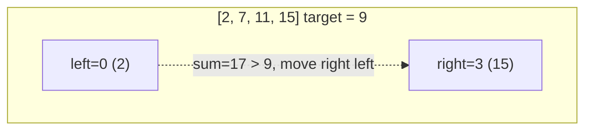
*Two pointers start at opposite ends of a sorted array and converge — each comparison eliminates one element from further consideration, giving O(n) instead of the O(n²) all-pairs brute force.*

**Sliding window technique — Definition:** maintaining a contiguous subrange ("window") of the array/string that expands and contracts as it scans through, reusing work from the previous window position rather than recomputing from scratch — the standard approach for "find the best/longest/shortest contiguous subarray satisfying X" problems, typically O(n) instead of a naive O(n²).

```js
// longest substring without repeating characters
function longestUniqueSubstring(s) {
  const seen = new Map();
  let start = 0, maxLen = 0;
  for (let end = 0; end < s.length; end++) {
    if (seen.has(s[end]) && seen.get(s[end]) >= start) {
      start = seen.get(s[end]) + 1;
    }
    seen.set(s[end], end);
    maxLen = Math.max(maxLen, end - start + 1);
  }
  return maxLen;
}
```

**Prefix sums — Definition:** precomputing a running cumulative sum array so that the sum of any subrange `[i, j]` can be answered in O(1) (as `prefix[j] - prefix[i-1]`) after an O(n) precomputation, instead of re-summing the range every time — a classic trade of O(n) space for turning repeated O(n) range-sum queries into O(1).

```js
function buildPrefixSums(arr) {
  const prefix = [0];
  for (const num of arr) prefix.push(prefix[prefix.length - 1] + num);
  return prefix; // rangeSum(i, j) = prefix[j+1] - prefix[i]
}
```

**String fundamentals — Definition:** strings are typically **immutable** in high-level languages (JS, Python, Java) — any "modification" actually creates a new string — which is why repeatedly concatenating strings in a loop is O(n²) overall (each concatenation copies the whole string so far), and why an array/list (or a `StringBuilder`-equivalent) is preferred for building up a string incrementally.

**Common string algorithms** — palindrome check (two-pointer from both ends), anagram check (sort both strings and compare, or compare character-frequency maps), reversal (two-pointer swap in place).

**In-place vs extra-space techniques** — an **in-place** algorithm modifies the input using only O(1) extra space (e.g. reversing an array by swapping elements from both ends), as opposed to allocating a new structure to hold the result — often explicitly required by interview problem constraints.

**Practice problems:**

```js
// 1. Maximum Subarray (Kadane's algorithm) — O(n), running sum reset whenever it goes negative
function maxSubArray(nums) {
  let maxSum = nums[0], curr = nums[0];
  for (let i = 1; i < nums.length; i++) {
    curr = Math.max(nums[i], curr + nums[i]);
    maxSum = Math.max(maxSum, curr);
  }
  return maxSum;
}

// 2. Product of Array Except Self — O(n), no division, using prefix/suffix products
function productExceptSelf(nums) {
  const n = nums.length, res = new Array(n).fill(1);
  for (let i = 1, prefix = 1; i < n; i++) { prefix *= nums[i - 1]; res[i] = prefix; }
  for (let i = n - 2, suffix = 1; i >= 0; i--) { suffix *= nums[i + 1]; res[i] *= suffix; }
  return res;
}

// 3. Valid Anagram — frequency-map comparison, O(n)
function isAnagram(s, t) {
  if (s.length !== t.length) return false;
  const freq = {};
  for (const ch of s) freq[ch] = (freq[ch] || 0) + 1;
  for (const ch of t) {
    if (!freq[ch]) return false;
    freq[ch]--;
  }
  return true;
}

// 4. Container With Most Water — two pointers from both ends, O(n)
function maxArea(height) {
  let left = 0, right = height.length - 1, best = 0;
  while (left < right) {
    best = Math.max(best, Math.min(height[left], height[right]) * (right - left));
    height[left] < height[right] ? left++ : right--;
  }
  return best;
}

// 5. Merge Sorted Array (in-place) — fill from the back to avoid overwriting unread elements
function merge(nums1, m, nums2, n) {
  let i = m - 1, j = n - 1, k = m + n - 1;
  while (j >= 0) {
    nums1[k--] = (i >= 0 && nums1[i] > nums2[j]) ? nums1[i--] : nums2[j--];
  }
}
```

---

## 3. Linked Lists

**Definition:** a linked list is a linear data structure where each element ("node") holds its value plus a reference (pointer) to the next node, rather than being stored contiguously in memory like an array — insertion/deletion at a known position is O(1) (just repoint a few references), but random access by index is O(n) (must traverse from the head).

**Singly vs doubly linked lists — Definition:** a **singly** linked list's nodes point only to the *next* node (traversal is one-directional); a **doubly** linked list's nodes also point to the *previous* node, enabling O(1) traversal/deletion backward as well, at the cost of extra memory per node for the second pointer.

```js
class ListNode {
  constructor(val, next = null) { this.val = val; this.next = next; }
}
```

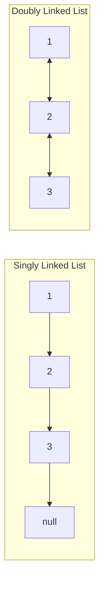

**Circular linked lists — Definition:** the last node's `next` points back to the first node (or, in a doubly-linked version, the structure forms a full ring) instead of pointing to `null` — used for scenarios needing continuous cycling through elements (e.g. a round-robin scheduler).

**Insertion/deletion/traversal complexity** — insert/delete at the head: O(1); at a known node (with a reference to it): O(1); at an arbitrary position by index/value: O(n) to first find it; traversal: O(n).

**Fast & slow pointers (Floyd's cycle detection) — Definition:** two pointers traverse the list at different speeds (typically one step vs two steps per iteration); if the list contains a cycle, the fast pointer will eventually "lap" and meet the slow pointer again — detects a cycle in O(n) time and O(1) space, without needing a separate visited-set.

```js
function hasCycle(head) {
  let slow = head, fast = head;
  while (fast && fast.next) {
    slow = slow.next;
    fast = fast.next.next;
    if (slow === fast) return true;
  }
  return false;
}
```

**Reversing a linked list:**

```js
// iterative — O(n) time, O(1) space
function reverseList(head) {
  let prev = null, curr = head;
  while (curr) {
    const next = curr.next;
    curr.next = prev;
    prev = curr;
    curr = next;
  }
  return prev;
}
```

**Merging linked lists** — merging two sorted linked lists is analogous to the merge step of merge sort (section 9), advancing two pointers and always taking the smaller current node — O(n + m) time, O(1) extra space (just relinking existing nodes).

**Linked lists vs arrays tradeoffs** — arrays: O(1) random access, cache-friendly (contiguous memory), but O(n) insert/delete in the middle and a fixed/resizing capacity; linked lists: O(1) insert/delete given a node reference, no resizing needed, but O(n) random access and worse cache locality (nodes scattered in memory) — choose based on whether the workload is access-heavy (arrays) or insert/delete-heavy at arbitrary positions (linked lists).

**Practice problems:**

```js
// 1. Merge Two Sorted Lists — O(n + m) time, O(1) extra space (relinking existing nodes)
function mergeTwoLists(l1, l2) {
  const dummy = new ListNode(0);
  let tail = dummy;
  while (l1 && l2) {
    if (l1.val <= l2.val) { tail.next = l1; l1 = l1.next; }
    else { tail.next = l2; l2 = l2.next; }
    tail = tail.next;
  }
  tail.next = l1 || l2;
  return dummy.next;
}

// 2. Find the Middle of a Linked List — fast/slow pointers, O(n) time, O(1) space
function middleNode(head) {
  let slow = head, fast = head;
  while (fast && fast.next) { slow = slow.next; fast = fast.next.next; }
  return slow;
}

// 3. Remove Nth Node From End — two pointers offset by n, single pass, O(n)
function removeNthFromEnd(head, n) {
  const dummy = new ListNode(0, head);
  let fast = dummy, slow = dummy;
  for (let i = 0; i < n; i++) fast = fast.next;
  while (fast.next) { fast = fast.next; slow = slow.next; }
  slow.next = slow.next.next;
  return dummy.next;
}

// 4. Linked List Cycle II (find the cycle's starting node) — Floyd's algorithm, then a second phase
function detectCycle(head) {
  let slow = head, fast = head;
  while (fast && fast.next) {
    slow = slow.next; fast = fast.next.next;
    if (slow === fast) {
      let ptr = head;
      while (ptr !== slow) { ptr = ptr.next; slow = slow.next; }
      return ptr; // the cycle's entry point
    }
  }
  return null;
}

// 5. Palindrome Linked List — find middle, reverse second half, compare, O(n) time, O(1) space
function isPalindrome(head) {
  let slow = head, fast = head;
  while (fast && fast.next) { slow = slow.next; fast = fast.next.next; }
  let prev = null;
  while (slow) { const next = slow.next; slow.next = prev; prev = slow; slow = next; }
  let left = head, right = prev;
  while (right) {
    if (left.val !== right.val) return false;
    left = left.next; right = right.next;
  }
  return true;
}
```

---

## 4. Stacks & Queues

**Stack — Definition:** a **LIFO** (Last-In, First-Out) data structure supporting `push` (add to top) and `pop` (remove from top), both O(1) — used for undo history, function call stacks, expression parsing, and backtracking (section 11).

```js
const stack = [];
stack.push(1); stack.push(2);
stack.pop(); // 2
```

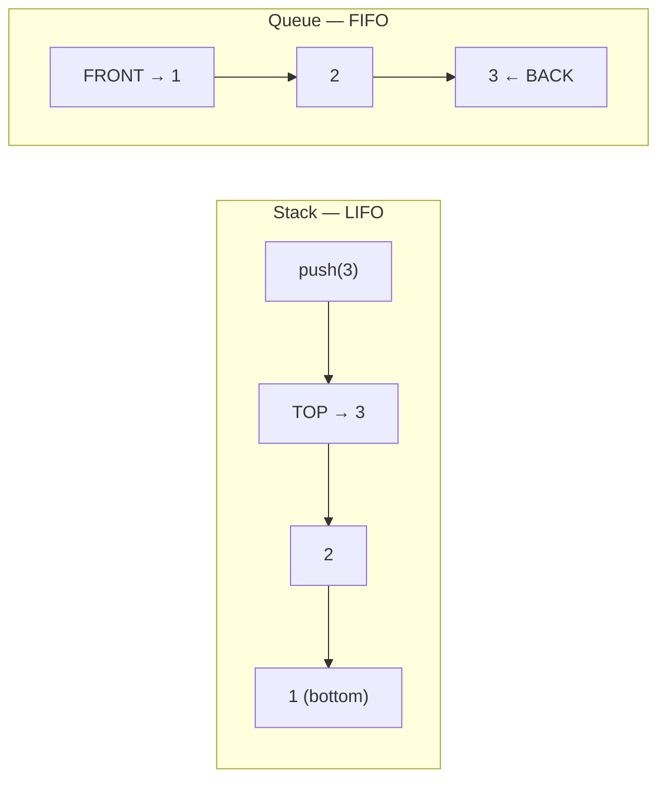

**Queue — Definition:** a **FIFO** (First-In, First-Out) data structure supporting `enqueue` (add to back) and `dequeue` (remove from front) — used for BFS (section 8), task scheduling, and any "process in arrival order" scenario. (A plain JS array's `.shift()` is O(n) — a real O(1) queue needs a proper circular buffer or linked-list implementation.)

**Deque (double-ended queue) — Definition:** supports O(1) insertion/removal at *both* ends — a generalization of both stack and queue, used in sliding-window-maximum-style problems (section 19) where elements need to be efficiently added/removed from either end.

**Implementing with arrays vs linked lists** — an array-backed stack/queue is simple and cache-friendly but (for a queue specifically) needs a circular-buffer trick to avoid O(n) shifting; a linked-list-backed stack/queue gets O(1) operations at both relevant ends naturally, at the cost of pointer overhead per element.

**Monotonic stack — Definition:** a stack maintained so its elements are always in strictly increasing (or decreasing) order — before pushing a new element, elements violating the monotonic property are popped off first — the classic technique for "next greater/smaller element" style problems, solving them in O(n) instead of a naive O(n²).

```js
// next greater element for each item
function nextGreaterElements(nums) {
  const result = new Array(nums.length).fill(-1);
  const stack = []; // stores indices
  for (let i = 0; i < nums.length; i++) {
    while (stack.length && nums[stack[stack.length - 1]] < nums[i]) {
      result[stack.pop()] = nums[i];
    }
    stack.push(i);
  }
  return result;
}
```

**Queue using two stacks (and vice versa)** — a classic exercise demonstrating how to emulate one structure's ordering using another: a queue can be built from two stacks (one for enqueue, one reversed lazily for dequeue), giving amortized O(1) operations overall despite occasional O(n) transfers between the stacks.

**Common applications** — balanced parentheses matching (stack), BFS traversal (queue), expression evaluation (stack, for operators/operands), the browser's back/forward history (stack).

**Practice problems:**

```js
// 1. Valid Parentheses — push opening brackets, pop and match on closing, O(n)
function isValid(s) {
  const stack = [];
  const pairs = { ')': '(', ']': '[', '}': '{' };
  for (const ch of s) {
    if (ch === '(' || ch === '[' || ch === '{') stack.push(ch);
    else if (stack.pop() !== pairs[ch]) return false;
  }
  return stack.length === 0;
}

// 2. Min Stack — a stack supporting getMin() in O(1) by tracking a running-min alongside each value
class MinStack {
  constructor() { this.stack = []; }
  push(val) {
    const min = this.stack.length ? Math.min(val, this.stack[this.stack.length - 1][1]) : val;
    this.stack.push([val, min]);
  }
  pop() { this.stack.pop(); }
  top() { return this.stack[this.stack.length - 1][0]; }
  getMin() { return this.stack[this.stack.length - 1][1]; }
}

// 3. Evaluate Reverse Polish Notation — stack-based expression evaluation, O(n)
function evalRPN(tokens) {
  const stack = [];
  const ops = { '+': (a, b) => a + b, '-': (a, b) => a - b, '*': (a, b) => a * b, '/': (a, b) => Math.trunc(a / b) };
  for (const t of tokens) {
    if (t in ops) { const b = stack.pop(), a = stack.pop(); stack.push(ops[t](a, b)); }
    else stack.push(Number(t));
  }
  return stack.pop();
}

// 4. Sliding Window Maximum — monotonic deque, O(n) instead of a naive O(n·k)
function maxSlidingWindow(nums, k) {
  const deque = []; // stores indices, values kept in decreasing order
  const result = [];
  for (let i = 0; i < nums.length; i++) {
    while (deque.length && deque[0] <= i - k) deque.shift();
    while (deque.length && nums[deque[deque.length - 1]] < nums[i]) deque.pop();
    deque.push(i);
    if (i >= k - 1) result.push(nums[deque[0]]);
  }
  return result;
}

// 5. Implement Queue using Stacks — amortized O(1) per operation
class MyQueue {
  constructor() { this.inStack = []; this.outStack = []; }
  push(x) { this.inStack.push(x); }
  pop() {
    if (!this.outStack.length) while (this.inStack.length) this.outStack.push(this.inStack.pop());
    return this.outStack.pop();
  }
}
```

---

## 5. Hash Tables

**Definition:** a hash table is a data structure mapping keys to values, using a **hash function** to convert a key into an array index, giving **average O(1)** insert/lookup/delete — the workhorse structure behind JS's `Map`/`Set`/plain objects, Python's `dict`, and countless algorithmic optimizations throughout this roadmap.

**Hash function — Definition:** a function that deterministically converts a key (of any type) into a fixed-range integer (the bucket index) — a good hash function distributes keys uniformly across buckets (minimizing collisions) and is fast to compute.

**Collision resolution — Definition:** since a hash function maps a large key space into a smaller fixed number of buckets, two different keys can hash to the same index (a **collision**) — resolved via:
- **Chaining** — each bucket holds a small list (or tree, in some real implementations) of all entries that hashed there; lookup means hashing to the bucket, then scanning that bucket's list.
- **Open addressing** — on a collision, probe for the next available slot according to a fixed rule: **linear probing** (check the next slot sequentially), **quadratic probing** (check slots at increasing quadratic offsets, reducing clustering), **double hashing** (use a second hash function to determine the probe step size).

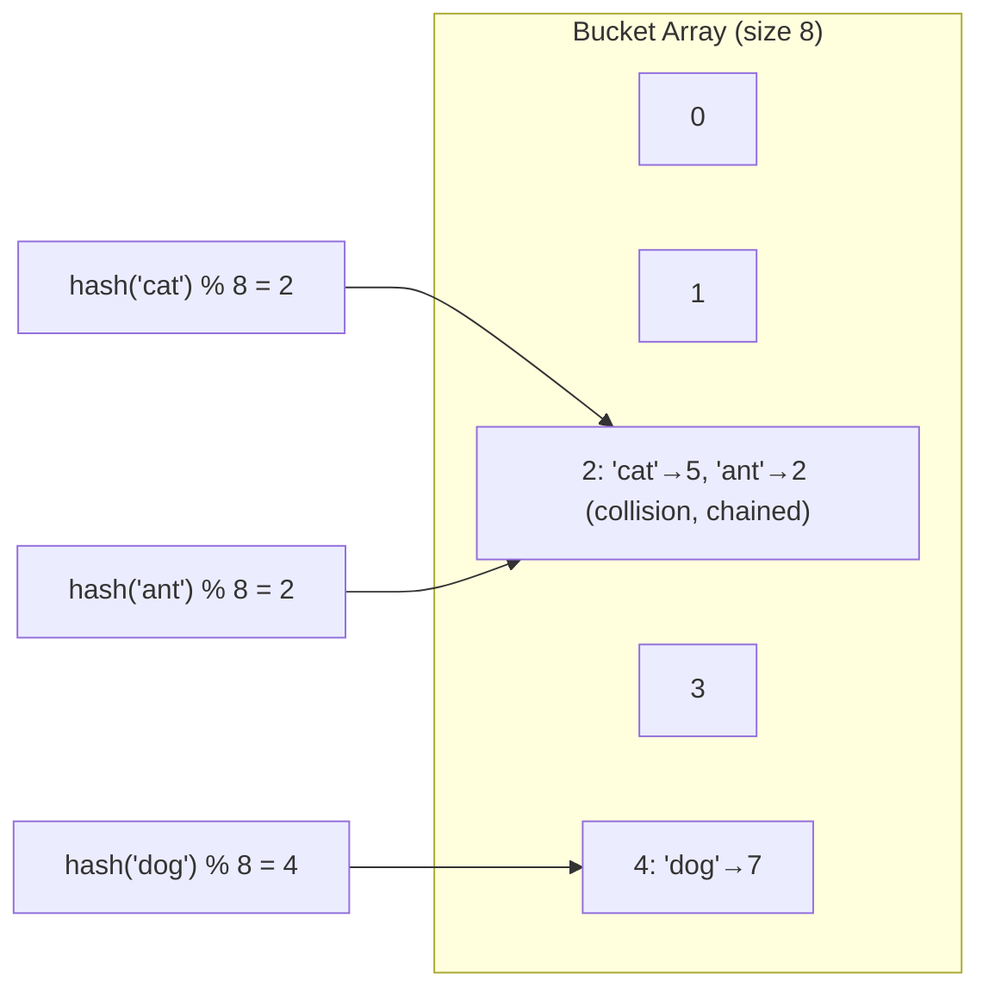
*'cat' and 'ant' both hash to bucket 2 — a collision, resolved here via chaining (both entries stored together in that bucket's small list).*

**Load factor & resizing — Definition:** the load factor is `number of entries ÷ number of buckets` — as it grows past a threshold (commonly ~0.7), collision frequency rises and performance degrades toward O(n); hash tables automatically **resize** (allocate a larger bucket array and rehash every existing entry into it) to keep the load factor bounded, similar in spirit to a dynamic array's amortized-O(1) resize (section 2).

**Time complexity (average vs worst case) — Definition:** hash table operations are O(1) **on average**, assuming a reasonably uniform hash function and load factor, but **O(n) in the worst case** — if every key happens to hash to the same bucket (a pathological hash function, or an adversarial input designed to cause collisions), lookup degrades to scanning a single long chain.

**Hash sets vs hash maps — Definition:** a **hash set** stores only keys (answering "is this present?" in O(1)); a **hash map** stores key-value pairs (answering "what value is associated with this key?" in O(1)) — a hash set is effectively a hash map that ignores the value.

**Common use cases & patterns:**

```js
// classic use: two-sum in O(n) using a hash map, instead of O(n²) brute force
function twoSum(nums, target) {
  const seen = new Map(); // value -> index
  for (let i = 0; i < nums.length; i++) {
    const complement = target - nums[i];
    if (seen.has(complement)) return [seen.get(complement), i];
    seen.set(nums[i], i);
  }
  return null;
}

// deduplication, frequency counting, grouping (anagrams) are all hash-map-driven patterns
```

**Practice problems:**

```js
// 1. Group Anagrams — bucket words by their sorted-character key, O(n · k log k)
function groupAnagrams(strs) {
  const groups = new Map();
  for (const s of strs) {
    const key = s.split('').sort().join('');
    if (!groups.has(key)) groups.set(key, []);
    groups.get(key).push(s);
  }
  return [...groups.values()];
}

// 2. Longest Consecutive Sequence — O(n) using a hash set (only start counting from sequence heads)
function longestConsecutive(nums) {
  const set = new Set(nums);
  let longest = 0;
  for (const n of set) {
    if (!set.has(n - 1)) { // only start counting from the beginning of a run
      let length = 1;
      while (set.has(n + length)) length++;
      longest = Math.max(longest, length);
    }
  }
  return longest;
}

// 3. Subarray Sum Equals K — prefix-sum counts stored in a hash map, O(n)
function subarraySum(nums, k) {
  const counts = new Map([[0, 1]]);
  let sum = 0, result = 0;
  for (const n of nums) {
    sum += n;
    result += counts.get(sum - k) || 0;
    counts.set(sum, (counts.get(sum) || 0) + 1);
  }
  return result;
}

// 4. First Non-Repeating Character — frequency map, then a second pass, O(n)
function firstUniqChar(s) {
  const freq = {};
  for (const ch of s) freq[ch] = (freq[ch] || 0) + 1;
  for (let i = 0; i < s.length; i++) if (freq[s[i]] === 1) return i;
  return -1;
}

// 5. LRU Cache — hash map + doubly linked list for O(1) get/put (Map preserves insertion order in JS)
class LRUCache {
  constructor(capacity) { this.capacity = capacity; this.map = new Map(); }
  get(key) {
    if (!this.map.has(key)) return -1;
    const val = this.map.get(key);
    this.map.delete(key); this.map.set(key, val); // refresh recency
    return val;
  }
  put(key, value) {
    if (this.map.has(key)) this.map.delete(key);
    else if (this.map.size >= this.capacity) this.map.delete(this.map.keys().next().value);
    this.map.set(key, value);
  }
}
```

---

## 6. Trees

**Definition:** a tree is a hierarchical, non-linear data structure of nodes connected by edges, with one designated **root** and no cycles — every node except the root has exactly one parent, and any node may have zero or more children.

**Terminology — Definition:** **root** (the topmost node, no parent); **leaf** (a node with no children); **height** of a node (the number of edges on the longest downward path to a leaf); **depth** of a node (the number of edges from the root to it).

**Binary tree — Definition:** a tree where every node has **at most two** children, conventionally called `left` and `right`.

```js
class TreeNode {
  constructor(val, left = null, right = null) { this.val = val; this.left = left; this.right = right; }
}
```

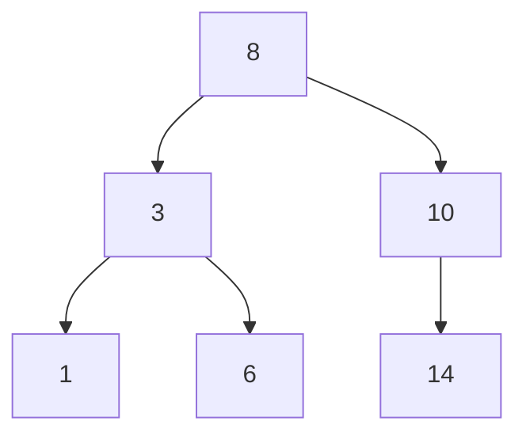
*In-order traversal (left, node, right) of this BST visits 1, 3, 6, 8, 10, 14 — ascending sorted order, exactly as section 6's traversal definitions describe.*

**Binary Search Tree (BST) — Definition:** a binary tree with the ordering invariant that, for every node, all values in its **left** subtree are smaller and all values in its **right** subtree are larger — this invariant is what makes search/insert/delete O(log n) on a **balanced** BST (each comparison eliminates roughly half the remaining tree, the same logic as binary search, section 10) — but O(n) worst case on a degenerate/unbalanced BST (e.g. one built by inserting already-sorted data, producing what's effectively a linked list).

```js
function bstSearch(node, target) {
  if (!node || node.val === target) return node;
  return target < node.val ? bstSearch(node.left, target) : bstSearch(node.right, target);
}
```

**Traversals — Definition:**
- **In-order** (left, node, right) — visits BST nodes in ascending sorted order.
- **Pre-order** (node, left, right) — visits the root before its subtrees; useful for copying/serializing a tree's structure.
- **Post-order** (left, right, node) — visits children before the node itself; useful when children must be processed before their parent (e.g. deleting a tree bottom-up).
- **Level-order (BFS)** — visits nodes level by level, using a queue (section 4) rather than recursion.

```js
function inOrder(node, result = []) {
  if (!node) return result;
  inOrder(node.left, result);
  result.push(node.val);
  inOrder(node.right, result);
  return result;
}
```

**Balanced vs unbalanced trees** — a **balanced** tree keeps its height at O(log n) by construction (see AVL/Red-Black in section 18), guaranteeing O(log n) operations; an **unbalanced** tree offers no such guarantee and can degrade to O(n) — this is precisely why self-balancing trees exist.

**Lowest Common Ancestor (LCA) — Definition:** the deepest node in a tree that has both of two given nodes as descendants (a node can be its own ancestor for this purpose) — a classic tree problem solvable via recursive traversal (checking whether each target is found in the left/right subtree, or is the current node) in O(n).

**Serializing/deserializing a tree — Definition:** converting a tree structure into a linear format (a string/array, e.g. via pre-order traversal with explicit `null` markers for missing children) that can later be reconstructed back into the identical tree structure — used for persisting/transmitting tree-shaped data.

**Practice problems:**

```js
// 1. Maximum Depth of Binary Tree — recursive post-order, O(n)
function maxDepth(root) {
  if (!root) return 0;
  return 1 + Math.max(maxDepth(root.left), maxDepth(root.right));
}

// 2. Validate Binary Search Tree — recursive with a valid (low, high) range carried down, O(n)
function isValidBST(root, low = -Infinity, high = Infinity) {
  if (!root) return true;
  if (root.val <= low || root.val >= high) return false;
  return isValidBST(root.left, low, root.val) && isValidBST(root.right, root.val, high);
}

// 3. Lowest Common Ancestor of a Binary Tree — O(n), recurse and combine
function lowestCommonAncestor(root, p, q) {
  if (!root || root === p || root === q) return root;
  const left = lowestCommonAncestor(root.left, p, q);
  const right = lowestCommonAncestor(root.right, p, q);
  if (left && right) return root; // p and q found in different subtrees — root is the LCA
  return left || right;
}

// 4. Level Order Traversal — BFS with a queue, grouping by level, O(n)
function levelOrder(root) {
  if (!root) return [];
  const result = [], queue = [root];
  while (queue.length) {
    const levelSize = queue.length, level = [];
    for (let i = 0; i < levelSize; i++) {
      const node = queue.shift();
      level.push(node.val);
      if (node.left) queue.push(node.left);
      if (node.right) queue.push(node.right);
    }
    result.push(level);
  }
  return result;
}

// 5. Diameter of Binary Tree — longest path between any two nodes, tracked via post-order height calc
function diameterOfBinaryTree(root) {
  let diameter = 0;
  function height(node) {
    if (!node) return 0;
    const left = height(node.left), right = height(node.right);
    diameter = Math.max(diameter, left + right);
    return 1 + Math.max(left, right);
  }
  height(root);
  return diameter;
}
```

---

## 7. Heaps & Priority Queues

**Heap — Definition:** a **complete binary tree** (every level fully filled except possibly the last, which fills left-to-right) satisfying the **heap property**: in a **min-heap**, every parent is ≤ its children (so the minimum element is always at the root); in a **max-heap**, every parent is ≥ its children (maximum always at the root). Because it's complete, a heap is typically stored compactly in a plain array, with a node at index `i` having children at `2i+1`/`2i+2` — no explicit pointers needed.

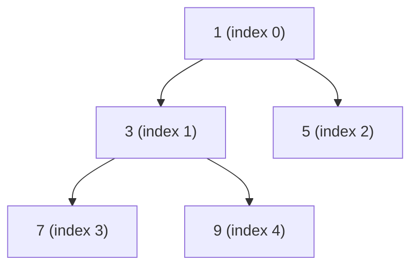
*A min-heap: every parent ≤ its children. Stored as the array `[1, 3, 5, 7, 9]` — node at index `i` has children at `2i+1`/`2i+2`, no pointers needed at all.*

**Heap operations — Definition:**
- **Insert** — add the new element at the end of the array, then "bubble up" (swap with its parent repeatedly) until the heap property is restored — O(log n).
- **Extract-min/max** — remove the root, move the last element into the root position, then "bubble down" (swap with the smaller/larger child repeatedly) until the heap property is restored — O(log n).
- **Heapify** — converting an arbitrary array into a valid heap in-place — O(n) (not O(n log n) — a subtlety that comes from most nodes being near the bottom of the tree, needing very little bubbling).

```js
class MinHeap {
  constructor() { this.data = []; }
  peek() { return this.data[0]; }
  insert(val) {
    this.data.push(val);
    let i = this.data.length - 1;
    while (i > 0) {
      const parent = Math.floor((i - 1) / 2);
      if (this.data[parent] <= this.data[i]) break;
      [this.data[parent], this.data[i]] = [this.data[i], this.data[parent]];
      i = parent;
    }
  }
  extractMin() {
    const min = this.data[0];
    const last = this.data.pop();
    if (this.data.length) {
      this.data[0] = last;
      let i = 0;
      while (true) {
        const l = 2 * i + 1, r = 2 * i + 2;
        let smallest = i;
        if (l < this.data.length && this.data[l] < this.data[smallest]) smallest = l;
        if (r < this.data.length && this.data[r] < this.data[smallest]) smallest = r;
        if (smallest === i) break;
        [this.data[i], this.data[smallest]] = [this.data[smallest], this.data[i]];
        i = smallest;
      }
    }
    return min;
  }
}
```

**Priority queue as an ADT — Definition:** an abstract data type where each element has an associated priority, and removal always returns the highest-priority (or lowest, depending on convention) element first — a heap is the standard, efficient concrete implementation of a priority queue.

**Common heap problems** — "k largest/smallest elements" (maintain a heap of size k, O(n log k) instead of sorting the whole array); "merge k sorted lists" (a min-heap holding the current front of each list, always extracting the global minimum next, O(n log k)); Dijkstra's algorithm (section 8) uses a min-heap to always process the next-closest unvisited node.

**Practice problems:**

```js
// 1. Kth Largest Element in an Array — min-heap of size k, O(n log k)
function findKthLargest(nums, k) {
  const heap = new MinHeap();
  for (const n of nums) {
    heap.insert(n);
    if (heap.data.length > k) heap.extractMin();
  }
  return heap.peek();
}

// 2. Top K Frequent Elements — frequency count, then a min-heap of size k, O(n log k)
function topKFrequent(nums, k) {
  const freq = new Map();
  for (const n of nums) freq.set(n, (freq.get(n) || 0) + 1);
  return [...freq.entries()].sort((a, b) => b[1] - a[1]).slice(0, k).map(([val]) => val);
}

// 3. Merge k Sorted Lists — a min-heap holding each list's current head, O(n log k)
function mergeKLists(lists) {
  const heap = lists.filter(Boolean).map(node => node);
  heap.sort((a, b) => a.val - b.val); // simplified with array-sort in place of a full heap class
  const dummy = new ListNode(0);
  let tail = dummy;
  while (heap.length) {
    const node = heap.shift();
    tail.next = node; tail = tail.next;
    if (node.next) { heap.push(node.next); heap.sort((a, b) => a.val - b.val); }
  }
  return dummy.next;
}

// 4. Find Median from Data Stream — two heaps (a max-heap for the lower half, min-heap for the upper half)
class MedianFinder {
  constructor() { this.lower = []; this.upper = []; } // lower: max-heap (desc), upper: min-heap (asc)
  addNum(num) {
    this.lower.push(num); this.lower.sort((a, b) => b - a);
    this.upper.push(this.lower.shift()); this.upper.sort((a, b) => a - b);
    if (this.upper.length > this.lower.length) this.lower.push(this.upper.shift());
  }
  findMedian() {
    if (this.lower.length > this.upper.length) return this.lower[0];
    return (this.lower[0] + this.upper[0]) / 2;
  }
}

// 5. Task Scheduler — greedy + max-heap of remaining task counts, cooldown-aware scheduling
function leastInterval(tasks, n) {
  const freq = {};
  for (const t of tasks) freq[t] = (freq[t] || 0) + 1;
  const counts = Object.values(freq).sort((a, b) => b - a);
  const maxCount = counts[0];
  const maxCountTasks = counts.filter(c => c === maxCount).length;
  return Math.max(tasks.length, (maxCount - 1) * (n + 1) + maxCountTasks);
}
```

---

## 8. Graphs

**Definition:** a graph is a data structure consisting of **vertices** (nodes) connected by **edges**, modeling pairwise relationships between entities — more general than a tree (which is a special case: a connected, acyclic graph). A graph may be **directed** (edges have a direction, `A → B` ≠ `B → A`) or **undirected**, and **weighted** (edges carry a cost/distance) or **unweighted**.

**Graph representations — Definition:**
- **Adjacency matrix** — an `n × n` grid where `matrix[i][j]` indicates (or weights) an edge between vertex `i` and `j` — O(1) edge-existence check, but O(n²) space regardless of how many edges actually exist, wasteful for sparse graphs.
- **Adjacency list** — each vertex stores a list of its directly-connected neighbors — O(V + E) space (proportional to actual edges present), the standard choice for most real graphs, which tend to be sparse.

```js
const graph = { A: ['B', 'C'], B: ['D'], C: ['D'], D: [] }; // adjacency list
```

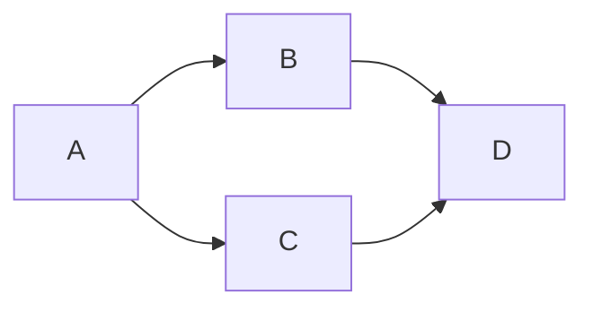

**Breadth-First Search (BFS) — Definition:** explores a graph level by level, visiting all neighbors of the current node before moving further out — implemented with a **queue** (section 4), giving O(V + E) time. Guarantees finding the **shortest path in an unweighted graph**, since it explores in strictly increasing distance order.

```js
function bfs(graph, start) {
  const visited = new Set([start]);
  const queue = [start];
  const order = [];
  while (queue.length) {
    const node = queue.shift();
    order.push(node);
    for (const neighbor of graph[node]) {
      if (!visited.has(neighbor)) { visited.add(neighbor); queue.push(neighbor); }
    }
  }
  return order;
}
```

**Depth-First Search (DFS) — Definition:** explores as far as possible down one path before backtracking — implemented with a **stack** (explicitly, or implicitly via recursion's call stack), also O(V + E). Used for cycle detection, topological sort, connected components, and path-finding where shortest-path isn't the requirement.

```js
function dfs(graph, node, visited = new Set(), order = []) {
  visited.add(node);
  order.push(node);
  for (const neighbor of graph[node]) {
    if (!visited.has(neighbor)) dfs(graph, neighbor, visited, order);
  }
  return order;
}
```

*BFS on the graph above, starting at A, visits in order A → B → C → D (level by level, via a queue). DFS starting at A visits A → B → D → C (as deep as possible down one path before backtracking, via a stack/recursion).*

**Topological sort — Definition:** an ordering of a **directed acyclic graph (DAG)**'s vertices such that every edge `u → v` has `u` appearing before `v` — used for scheduling problems with dependencies (e.g. course prerequisites, build order) — computable via DFS (append to result on a node's post-order finish, then reverse) or Kahn's algorithm (repeatedly remove nodes with zero remaining in-degree).

**Cycle detection — Definition:** in an **undirected** graph, a cycle exists if DFS encounters an already-visited node that isn't the immediate parent; in a **directed** graph, a cycle exists if DFS encounters a node currently on the *active recursion path* (not just visited overall — tracked via a separate "in current path" set), since revisiting an already-fully-explored-and-finished node in a directed graph doesn't necessarily indicate a cycle.

**Connected components — Definition:** the maximal groups of vertices such that every vertex in a group is reachable from every other vertex in that group — found by running BFS/DFS from any unvisited vertex, marking everything reached as one component, and repeating from the next unvisited vertex until all are covered.

**Shortest path algorithms — Definition:**
- **Dijkstra's algorithm** — finds shortest paths from a single source to all other vertices in a graph with **non-negative** edge weights, using a min-heap (section 7) to always expand the currently-closest unvisited vertex next — O((V + E) log V) with a binary heap.
- **Bellman-Ford** — also single-source shortest path, but tolerates **negative** edge weights (and can detect negative-weight cycles, which make "shortest path" ill-defined) — O(V × E), slower than Dijkstra but more general.
- **Floyd-Warshall** — computes shortest paths between **all pairs** of vertices simultaneously, via dynamic programming (section 13) over intermediate vertices — O(V³), suited to dense graphs or when all-pairs distances are genuinely needed.

**Minimum Spanning Tree (MST) — Definition:** a subset of a weighted, undirected, connected graph's edges that connects all vertices together, without any cycle, at the minimum possible total edge weight.
- **Kruskal's algorithm** — sort all edges by weight ascending, greedily add each edge unless it would create a cycle (checked efficiently via Union-Find, section 17) — O(E log E).
- **Prim's algorithm** — grow the MST one vertex at a time, always adding the cheapest edge connecting the current tree to a new vertex (using a min-heap) — O(E log V).

**Practice problems:**

```js
// 1. Number of Islands — grid DFS/BFS, flood-fill connected land cells, O(rows × cols)
function numIslands(grid) {
  let count = 0;
  const rows = grid.length, cols = grid[0].length;
  function dfs(r, c) {
    if (r < 0 || c < 0 || r >= rows || c >= cols || grid[r][c] !== '1') return;
    grid[r][c] = '0'; // mark visited
    dfs(r + 1, c); dfs(r - 1, c); dfs(r, c + 1); dfs(r, c - 1);
  }
  for (let r = 0; r < rows; r++)
    for (let c = 0; c < cols; c++)
      if (grid[r][c] === '1') { count++; dfs(r, c); }
  return count;
}

// 2. Course Schedule (cycle detection in a directed graph) — DFS with a recursion-path tracker
function canFinish(numCourses, prerequisites) {
  const graph = Array.from({ length: numCourses }, () => []);
  for (const [a, b] of prerequisites) graph[a].push(b);
  const state = new Array(numCourses).fill(0); // 0=unvisited, 1=in-progress, 2=done
  function hasCycle(node) {
    if (state[node] === 1) return true;
    if (state[node] === 2) return false;
    state[node] = 1;
    for (const next of graph[node]) if (hasCycle(next)) return true;
    state[node] = 2;
    return false;
  }
  for (let i = 0; i < numCourses; i++) if (hasCycle(i)) return false;
  return true;
}

// 3. Clone Graph — BFS/DFS with a map from original node to its clone, O(V + E)
function cloneGraph(node) {
  if (!node) return null;
  const visited = new Map();
  function dfs(n) {
    if (visited.has(n)) return visited.get(n);
    const clone = { val: n.val, neighbors: [] };
    visited.set(n, clone);
    for (const neighbor of n.neighbors) clone.neighbors.push(dfs(neighbor));
    return clone;
  }
  return dfs(node);
}

// 4. Network Delay Time (Dijkstra's algorithm) — shortest time for a signal to reach all nodes
function networkDelayTime(times, n, k) {
  const graph = new Map();
  for (const [u, v, w] of times) {
    if (!graph.has(u)) graph.set(u, []);
    graph.get(u).push([v, w]);
  }
  const dist = new Array(n + 1).fill(Infinity);
  dist[k] = 0;
  const pq = [[0, k]]; // [distance, node] — simplified priority queue via sort
  while (pq.length) {
    pq.sort((a, b) => a[0] - b[0]);
    const [d, u] = pq.shift();
    if (d > dist[u]) continue;
    for (const [v, w] of graph.get(u) || []) {
      if (d + w < dist[v]) { dist[v] = d + w; pq.push([dist[v], v]); }
    }
  }
  const maxDist = Math.max(...dist.slice(1));
  return maxDist === Infinity ? -1 : maxDist;
}

// 5. Word Ladder (shortest transformation via BFS) — unweighted shortest path, O(n × 26 × wordLength)
function ladderLength(beginWord, endWord, wordList) {
  const wordSet = new Set(wordList);
  if (!wordSet.has(endWord)) return 0;
  let queue = [beginWord], steps = 1;
  while (queue.length) {
    const next = [];
    for (const word of queue) {
      if (word === endWord) return steps;
      for (let i = 0; i < word.length; i++) {
        for (let c = 97; c <= 122; c++) {
          const candidate = word.slice(0, i) + String.fromCharCode(c) + word.slice(i + 1);
          if (wordSet.has(candidate)) { wordSet.delete(candidate); next.push(candidate); }
        }
      }
    }
    queue = next; steps++;
  }
  return 0;
}
```

---

## 9. Sorting Algorithms

**Comparison-based sorting — Definition:** algorithms that determine order purely by comparing pairs of elements — provably cannot do better than O(n log n) in the worst case (an information-theoretic lower bound: distinguishing between `n!` possible orderings requires at least `log₂(n!) ≈ n log n` comparisons).

**O(n²) family (simple, rarely used at scale):**
- **Bubble sort** — repeatedly swaps adjacent out-of-order elements until no swaps are needed.
- **Selection sort** — repeatedly finds the minimum of the unsorted remainder and swaps it into place.
- **Insertion sort** — builds the sorted portion one element at a time, inserting each new element into its correct position among those already sorted — efficient (close to O(n)) on **nearly-sorted** data specifically, which is why it's sometimes used as the base case for small subarrays within a larger, otherwise-O(n log n) sort.

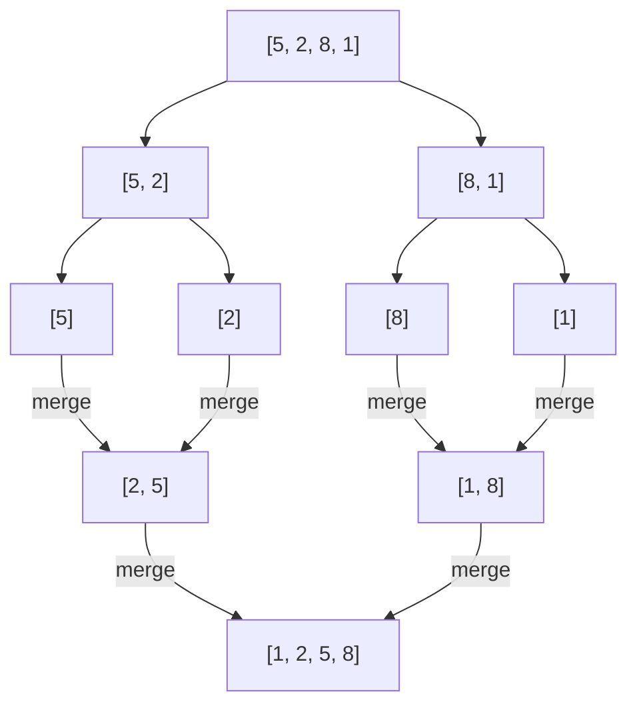
*Merge sort splits down to single elements (trivially sorted), then merges pairs back up in sorted order — the classic divide-and-conquer shape, O(n log n).*

**Merge sort — Definition:** a divide-and-conquer algorithm (section 12) that recursively splits the array in half, sorts each half, then merges the two sorted halves — guaranteed O(n log n) in all cases, and **stable** (equal elements retain their relative order), at the cost of O(n) extra space for the merge step.

```js
function mergeSort(arr) {
  if (arr.length <= 1) return arr;
  const mid = Math.floor(arr.length / 2);
  const left = mergeSort(arr.slice(0, mid));
  const right = mergeSort(arr.slice(mid));
  const result = [];
  let i = 0, j = 0;
  while (i < left.length && j < right.length) {
    result.push(left[i] <= right[j] ? left[i++] : right[j++]);
  }
  return [...result, ...left.slice(i), ...right.slice(j)];
}
```

**Quick sort — Definition:** picks a **pivot** element, partitions the array so smaller elements come before it and larger after, then recursively sorts each partition — average O(n log n), but **O(n²) worst case** (a consistently poor pivot choice, e.g. already-sorted input with a naive "always pick first element" pivot strategy) — typically faster than merge sort in practice due to in-place operation (O(log n) space for recursion, not O(n)) and good cache locality, though **not stable**.

**Heap sort — Definition:** builds a max-heap (section 7) from the array (O(n)), then repeatedly extracts the maximum and places it at the end — guaranteed O(n log n) worst case and O(1) extra space (fully in-place), but not stable and typically slower in practice than a well-implemented quick sort due to worse cache behavior.

**Non-comparison sorting — Definition:** algorithms that sort without comparing elements pairwise, instead exploiting known structure about the values (their range or digit representation) — can beat the O(n log n) comparison-sort lower bound, but only apply to specific kinds of input.
- **Counting sort** — counts occurrences of each distinct value (requires a known, small range of integer values), then reconstructs the sorted output from those counts — O(n + k) where `k` is the value range.
- **Radix sort** — sorts integers digit by digit (typically using counting sort as a subroutine per digit), from least to most significant — O(d × (n + k)) where `d` is the number of digits.
- **Bucket sort** — distributes elements into a number of buckets by value range, sorts each bucket individually (often with insertion sort), then concatenates — effective when input is uniformly distributed across a known range.

**Stability in sorting — Definition:** a sort is **stable** if elements that compare as equal retain their original relative order in the output — matters when sorting complex objects by one field while wanting ties broken by original order (e.g. stably sorting already-name-sorted records by department).

**Choosing the right sort** — in practice, use your language's built-in sort (which is typically a well-tuned hybrid, e.g. Timsort in Python/JS engines, combining merge sort's stability/guarantees with insertion sort's small-array efficiency) rather than hand-rolling one; understanding the algorithms above is for reasoning about complexity guarantees and for the specific non-comparison cases where they meaningfully outperform a general-purpose sort.

**In-place vs out-of-place** — an in-place sort (quick sort, heap sort) uses O(1) or O(log n) extra space by rearranging the input array directly; an out-of-place sort (merge sort, as typically implemented) allocates new space proportional to the input.

**Practice problems:**

```js
// 1. Quick sort implementation — average O(n log n), in-place partitioning
function quickSort(arr, low = 0, high = arr.length - 1) {
  if (low < high) {
    const pivot = arr[high];
    let i = low - 1;
    for (let j = low; j < high; j++) {
      if (arr[j] <= pivot) { i++; [arr[i], arr[j]] = [arr[j], arr[i]]; }
    }
    [arr[i + 1], arr[high]] = [arr[high], arr[i + 1]];
    quickSort(arr, low, i); quickSort(arr, i + 2, high);
  }
  return arr;
}

// 2. Sort Colors (Dutch National Flag) — one-pass, three-pointer partition into 0/1/2, O(n)
function sortColors(nums) {
  let low = 0, mid = 0, high = nums.length - 1;
  while (mid <= high) {
    if (nums[mid] === 0) { [nums[low], nums[mid]] = [nums[mid], nums[low]]; low++; mid++; }
    else if (nums[mid] === 1) mid++;
    else { [nums[mid], nums[high]] = [nums[high], nums[mid]]; high--; }
  }
  return nums;
}

// 3. Merge Intervals (recap section 19) — sort by start, merge overlaps in one pass, O(n log n)
function mergeIntervals(intervals) {
  intervals.sort((a, b) => a[0] - b[0]);
  const result = [intervals[0]];
  for (let i = 1; i < intervals.length; i++) {
    const last = result[result.length - 1];
    if (intervals[i][0] <= last[1]) last[1] = Math.max(last[1], intervals[i][1]);
    else result.push(intervals[i]);
  }
  return result;
}

// 4. Kth Largest via Quickselect — average O(n), a partition-based alternative to full sorting
function findKthLargestQuickselect(nums, k) {
  const target = nums.length - k;
  function partition(low, high) {
    const pivot = nums[high];
    let i = low;
    for (let j = low; j < high; j++) if (nums[j] < pivot) { [nums[i], nums[j]] = [nums[j], nums[i]]; i++; }
    [nums[i], nums[high]] = [nums[high], nums[i]];
    return i;
  }
  let low = 0, high = nums.length - 1;
  while (true) {
    const p = partition(low, high);
    if (p === target) return nums[p];
    p < target ? (low = p + 1) : (high = p - 1);
  }
}

// 5. Meeting Rooms II (minimum rooms needed) — sort start/end times separately, sweep, O(n log n)
function minMeetingRooms(intervals) {
  const starts = intervals.map(i => i[0]).sort((a, b) => a - b);
  const ends = intervals.map(i => i[1]).sort((a, b) => a - b);
  let rooms = 0, maxRooms = 0, s = 0, e = 0;
  while (s < starts.length) {
    if (starts[s] < ends[e]) { rooms++; s++; } else { rooms--; e++; }
    maxRooms = Math.max(maxRooms, rooms);
  }
  return maxRooms;
}
```

---

## 10. Searching Algorithms

**Linear search — Definition:** checks each element sequentially until the target is found or the input is exhausted — O(n), works on any (even unsorted) collection, and is the correct/only choice when the data has no exploitable order.

**Binary search — Definition:** on a **sorted** array, repeatedly compares the target to the middle element, eliminating half the remaining search space each time — O(log n), a direct consequence of halving the problem size at each step.

```js
function binarySearch(arr, target) {
  let left = 0, right = arr.length - 1;
  while (left <= right) {
    const mid = Math.floor((left + right) / 2);
    if (arr[mid] === target) return mid;
    arr[mid] < target ? (left = mid + 1) : (right = mid - 1);
  }
  return -1;
}
```

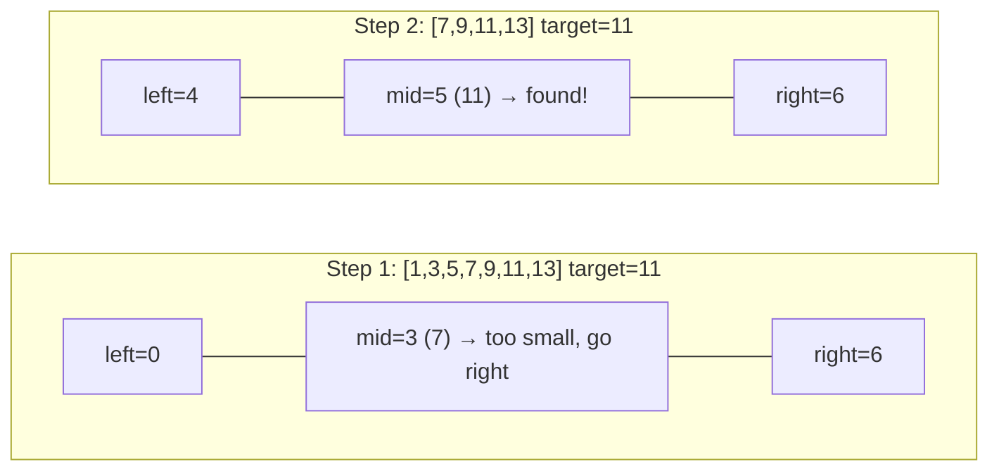
*Each comparison eliminates half the remaining search space — 7 elements narrows to 4, then to 1, in just 2 steps: O(log n).*

**Binary search on the answer — Definition:** a generalization of binary search beyond "find a value in a sorted array" — applied whenever the *answer space itself* is monotonic (e.g. "is capacity X sufficient?" is `false` for small X, then `true` for all X above some threshold) — binary search over that answer range to find the threshold, even when there's no literal sorted array involved (e.g. "minimum ship capacity to deliver packages within D days").

**Finding boundaries (first/last occurrence) — Definition:** a variant of binary search that, upon finding a match, doesn't stop immediately but continues narrowing toward the leftmost or rightmost occurrence of that value in a sorted array with duplicates — still O(log n).

**Search in rotated sorted arrays — Definition:** a sorted array that's been rotated at an unknown pivot (e.g. `[4,5,6,7,0,1,2]`) still has the property that at least one half (left or right of any midpoint) is guaranteed to be properly sorted — binary search is adapted to first determine which half is sorted, then decide whether the target could lie in that half, still achieving O(log n).

**Ternary search (brief) — Definition:** splits the search space into three parts instead of two, used specifically for finding an extremum (max/min) of a unimodal function — rarely more efficient than binary search for the "find a value" case, so it's a niche technique reserved for that specific unimodal-optimization scenario.

**Practice problems:**

```js
// 1. Search in Rotated Sorted Array — determine which half is sorted, then decide where to search, O(log n)
function searchRotated(nums, target) {
  let left = 0, right = nums.length - 1;
  while (left <= right) {
    const mid = Math.floor((left + right) / 2);
    if (nums[mid] === target) return mid;
    if (nums[left] <= nums[mid]) { // left half is sorted
      if (nums[left] <= target && target < nums[mid]) right = mid - 1;
      else left = mid + 1;
    } else { // right half is sorted
      if (nums[mid] < target && target <= nums[right]) left = mid + 1;
      else right = mid - 1;
    }
  }
  return -1;
}

// 2. Find First and Last Position of Element in Sorted Array — two binary searches for boundaries, O(log n)
function searchRange(nums, target) {
  function findBound(isFirst) {
    let left = 0, right = nums.length - 1, result = -1;
    while (left <= right) {
      const mid = Math.floor((left + right) / 2);
      if (nums[mid] === target) {
        result = mid;
        isFirst ? (right = mid - 1) : (left = mid + 1);
      } else nums[mid] < target ? (left = mid + 1) : (right = mid - 1);
    }
    return result;
  }
  return [findBound(true), findBound(false)];
}

// 3. Find Minimum in Rotated Sorted Array — binary search for the pivot point, O(log n)
function findMin(nums) {
  let left = 0, right = nums.length - 1;
  while (left < right) {
    const mid = Math.floor((left + right) / 2);
    nums[mid] > nums[right] ? (left = mid + 1) : (right = mid);
  }
  return nums[left];
}

// 4. Koko Eating Bananas (binary search on the answer) — find minimum eating speed to finish in time
function minEatingSpeed(piles, h) {
  let left = 1, right = Math.max(...piles);
  while (left < right) {
    const mid = Math.floor((left + right) / 2);
    const hoursNeeded = piles.reduce((sum, p) => sum + Math.ceil(p / mid), 0);
    hoursNeeded <= h ? (right = mid) : (left = mid + 1);
  }
  return left;
}

// 5. Search a 2D Matrix — treat the matrix as a flattened sorted array, O(log(m·n))
function searchMatrix(matrix, target) {
  const rows = matrix.length, cols = matrix[0].length;
  let left = 0, right = rows * cols - 1;
  while (left <= right) {
    const mid = Math.floor((left + right) / 2);
    const val = matrix[Math.floor(mid / cols)][mid % cols];
    if (val === target) return true;
    val < target ? (left = mid + 1) : (right = mid - 1);
  }
  return false;
}
```

---

## 11. Recursion & Backtracking

**Recursion — Definition:** a function that solves a problem by calling itself on smaller subproblem(s), requiring a **base case** (the smallest subproblem, solved directly without further recursion) to terminate, and a **recursive case** that reduces the problem toward that base case.

```js
function factorial(n) {
  if (n <= 1) return 1;        // base case
  return n * factorial(n - 1); // recursive case
}
```

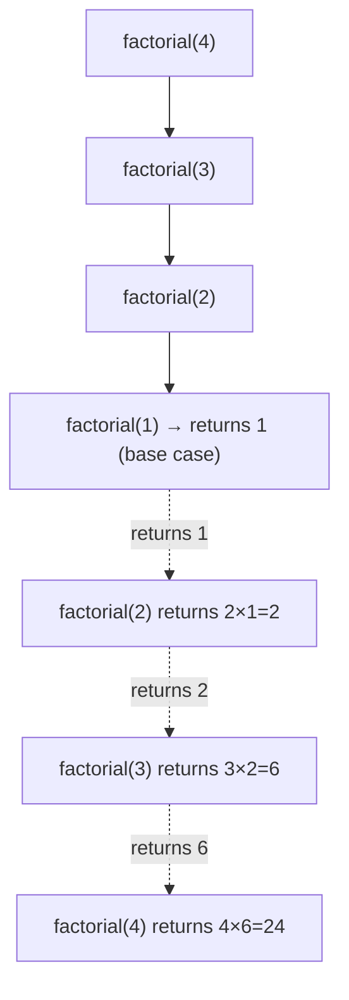
*Solid arrows show calls going deeper (building the call stack); dashed arrows show results unwinding back up as each call returns.*

**The call stack & recursion depth — Definition:** each recursive call pushes a new frame onto the program's call stack, holding that call's local variables/return address; a recursion that goes too deep (proportional to input size, for non-tail-optimized recursion) can exhaust the stack — a **"maximum call stack size exceeded"** error — which is why very deep recursion (e.g. over a very large linked list) is sometimes rewritten iteratively in practice.

**Recursion vs iteration** — any recursive algorithm can be rewritten iteratively (using an explicit stack to manage what the call stack would have tracked) — recursion often expresses divide-and-conquer/tree/graph traversal logic more naturally and readably, while iteration avoids call-stack overhead and depth limits.

**Tail recursion (brief) — Definition:** a recursive call is in **tail position** if it's the very last operation in the function (nothing left to do with its result after it returns) — some languages/runtimes optimize tail calls into a plain loop internally (constant stack space); **standard JavaScript engines do not perform this optimization** in practice (despite it being in the ES2015 spec), so deep tail-recursive JS functions can still overflow the stack.

**Backtracking — Definition:** a refinement of brute-force recursive search that builds a solution incrementally, and **abandons ("backtracks" from) a partial solution as soon as it's determined it cannot possibly lead to a valid complete solution** — avoiding wasted exploration of the entire remaining search space from a doomed partial state.

```js
// generate all subsets of an array
function subsets(nums) {
  const result = [];
  function backtrack(start, current) {
    result.push([...current]);
    for (let i = start; i < nums.length; i++) {
      current.push(nums[i]);
      backtrack(i + 1, current); // explore
      current.pop();             // un-choose — the "backtrack" step
    }
  }
  backtrack(0, []);
  return result;
}
```

**Common backtracking problems** — **permutations** (try each unused element next, at every position), **combinations**/**subsets** (as above — include or exclude each element), **N-Queens** (place queens row by row, backtracking whenever a placement conflicts with an existing queen), **Sudoku solver** (try each valid digit in the next empty cell, backtracking on a dead end) — all share the identical "choose → explore → un-choose" skeleton shown above.

**Practice problems:**

```js
// 1. Permutations — choose each unused element next, at every position, O(n · n!)
function permute(nums) {
  const result = [];
  function backtrack(current, remaining) {
    if (!remaining.length) { result.push([...current]); return; }
    for (let i = 0; i < remaining.length; i++) {
      current.push(remaining[i]);
      backtrack(current, [...remaining.slice(0, i), ...remaining.slice(i + 1)]);
      current.pop();
    }
  }
  backtrack([], nums);
  return result;
}

// 2. Combination Sum — reuse allowed, prune once the running sum exceeds target
function combinationSum(candidates, target) {
  const result = [];
  function backtrack(start, remaining, current) {
    if (remaining === 0) { result.push([...current]); return; }
    if (remaining < 0) return;
    for (let i = start; i < candidates.length; i++) {
      current.push(candidates[i]);
      backtrack(i, remaining - candidates[i], current); // i, not i+1 — reuse allowed
      current.pop();
    }
  }
  backtrack(0, target, []);
  return result;
}

// 3. N-Queens — place queens row by row, backtrack on column/diagonal conflicts
function solveNQueens(n) {
  const results = [];
  const cols = new Set(), diag1 = new Set(), diag2 = new Set();
  const board = Array.from({ length: n }, () => new Array(n).fill('.'));
  function backtrack(row) {
    if (row === n) { results.push(board.map(r => r.join(''))); return; }
    for (let col = 0; col < n; col++) {
      if (cols.has(col) || diag1.has(row - col) || diag2.has(row + col)) continue;
      cols.add(col); diag1.add(row - col); diag2.add(row + col); board[row][col] = 'Q';
      backtrack(row + 1);
      cols.delete(col); diag1.delete(row - col); diag2.delete(row + col); board[row][col] = '.';
    }
  }
  backtrack(0);
  return results;
}

// 4. Word Search (grid backtracking) — DFS with a visited marker, backtracking on dead ends
function exist(board, word) {
  const rows = board.length, cols = board[0].length;
  function backtrack(r, c, i) {
    if (i === word.length) return true;
    if (r < 0 || c < 0 || r >= rows || c >= cols || board[r][c] !== word[i]) return false;
    const temp = board[r][c];
    board[r][c] = '#'; // mark visited
    const found = backtrack(r + 1, c, i + 1) || backtrack(r - 1, c, i + 1) ||
                  backtrack(r, c + 1, i + 1) || backtrack(r, c - 1, i + 1);
    board[r][c] = temp; // un-choose
    return found;
  }
  for (let r = 0; r < rows; r++)
    for (let c = 0; c < cols; c++)
      if (backtrack(r, c, 0)) return true;
  return false;
}

// 5. Generate Parentheses — backtrack, tracking open/close counts, O(4ⁿ/√n) valid combinations
function generateParenthesis(n) {
  const result = [];
  function backtrack(current, open, close) {
    if (current.length === 2 * n) { result.push(current); return; }
    if (open < n) backtrack(current + '(', open + 1, close);
    if (close < open) backtrack(current + ')', open, close + 1);
  }
  backtrack('', 0, 0);
  return result;
}
```

---

## 12. Divide & Conquer

**Definition:** an algorithmic paradigm that solves a problem by **dividing** it into smaller subproblems of the same type, **conquering** each subproblem recursively, and **combining** their results into the solution for the original problem — merge sort, quick sort, and binary search (sections 9–10) are all divide-and-conquer algorithms.

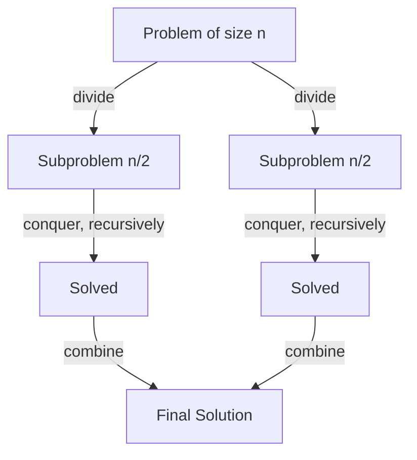

**Master theorem (brief) — Definition:** provides a direct formula for the complexity of a recurrence of the form `T(n) = a·T(n/b) + O(n^d)` (divide into `a` subproblems of size `n/b`, plus `O(n^d)` work to combine) without needing to solve the recursion tree manually each time — e.g. merge sort's `T(n) = 2T(n/2) + O(n)` resolves to O(n log n) directly via the theorem.

**Closest pair of points (brief) — Definition:** a classic divide-and-conquer problem — finding the two closest points among `n` points in a plane — a naive approach compares every pair (O(n²)), while the divide-and-conquer approach splits the points, solves each half, then carefully checks only a narrow strip near the dividing line for a closer cross-half pair, achieving O(n log n).

**Fast exponentiation — Definition:** computing `base^exponent` in O(log exponent) instead of a naive O(exponent) by repeated squaring: `x^n = (x^(n/2))²` (adjusted for odd `n`) — a divide-and-conquer application to a numeric problem rather than a data structure.

```js
function fastPow(base, exp) {
  if (exp === 0) return 1;
  const half = fastPow(base, Math.floor(exp / 2));
  return exp % 2 === 0 ? half * half : half * half * base;
}
```

**Practice problems:**

```js
// 1. Merge Sort implementation (recap) — O(n log n), stable, the canonical divide-and-conquer example
function mergeSortDC(arr) {
  if (arr.length <= 1) return arr;
  const mid = Math.floor(arr.length / 2);
  const left = mergeSortDC(arr.slice(0, mid)), right = mergeSortDC(arr.slice(mid));
  const merged = [];
  let i = 0, j = 0;
  while (i < left.length && j < right.length) merged.push(left[i] <= right[j] ? left[i++] : right[j++]);
  return [...merged, ...left.slice(i), ...right.slice(j)];
}

// 2. Maximum Subarray via Divide & Conquer — O(n log n) alternative to Kadane's O(n) (illustrates the paradigm)
function maxSubArrayDC(nums, low = 0, high = nums.length - 1) {
  if (low === high) return nums[low];
  const mid = Math.floor((low + high) / 2);
  const leftMax = maxSubArrayDC(nums, low, mid);
  const rightMax = maxSubArrayDC(nums, mid + 1, high);
  let leftCross = -Infinity, sum = 0;
  for (let i = mid; i >= low; i--) { sum += nums[i]; leftCross = Math.max(leftCross, sum); }
  let rightCross = -Infinity; sum = 0;
  for (let i = mid + 1; i <= high; i++) { sum += nums[i]; rightCross = Math.max(rightCross, sum); }
  return Math.max(leftMax, rightMax, leftCross + rightCross);
}

// 3. Pow(x, n) — fast exponentiation handling negative exponents, O(log n)
function myPow(x, n) {
  if (n < 0) return 1 / myPow(x, -n);
  if (n === 0) return 1;
  const half = myPow(x, Math.floor(n / 2));
  return n % 2 === 0 ? half * half : half * half * x;
}

// 4. Count Inversions in an Array — modified merge sort, counts out-of-order pairs in O(n log n)
function countInversions(arr) {
  let count = 0;
  function mergeCount(a) {
    if (a.length <= 1) return a;
    const mid = Math.floor(a.length / 2);
    const left = mergeCount(a.slice(0, mid)), right = mergeCount(a.slice(mid));
    const merged = [];
    let i = 0, j = 0;
    while (i < left.length && j < right.length) {
      if (left[i] <= right[j]) merged.push(left[i++]);
      else { merged.push(right[j++]); count += left.length - i; } // all remaining left elements are inversions
    }
    return [...merged, ...left.slice(i), ...right.slice(j)];
  }
  mergeCount(arr);
  return count;
}

// 5. Majority Element (Boyer-Moore via divide & conquer alternative) — O(n log n) recursive version
function majorityElementDC(nums, low = 0, high = nums.length - 1) {
  if (low === high) return nums[low];
  const mid = Math.floor((low + high) / 2);
  const left = majorityElementDC(nums, low, mid), right = majorityElementDC(nums, mid + 1, high);
  if (left === right) return left;
  const countInRange = (candidate) => {
    let c = 0;
    for (let i = low; i <= high; i++) if (nums[i] === candidate) c++;
    return c;
  };
  return countInRange(left) > countInRange(right) ? left : right;
}
```

---

## 13. Dynamic Programming

A major deep-dive topic.

**Definition:** Dynamic Programming (DP) is a technique for solving problems by breaking them into overlapping subproblems, solving each subproblem **only once**, and storing (caching) its result for reuse — applicable specifically when a problem exhibits two properties: **optimal substructure** (an optimal solution to the problem can be constructed from optimal solutions to its subproblems) and **overlapping subproblems** (the same subproblems recur multiple times during a naive recursive solution — the key distinction from divide-and-conquer, section 12, whose subproblems are typically distinct/non-overlapping).

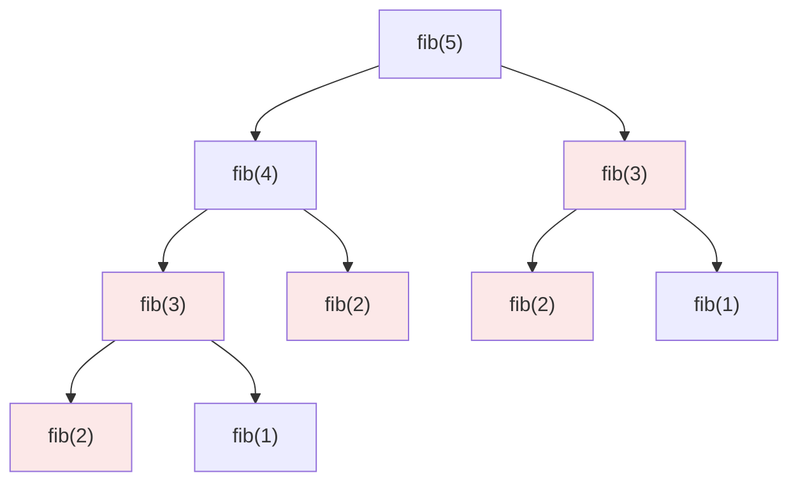
*Naive recursion recomputes fib(3) and fib(2) multiple times (highlighted) — these overlapping subproblems are exactly what memoization caches to avoid, turning O(2ⁿ) into O(n).*

**Memoization (top-down) vs tabulation (bottom-up) — Definition:**
- **Memoization** — write the natural recursive solution, but cache each subproblem's result (e.g. in a `Map` or array) the first time it's computed, and return the cached value on subsequent identical calls instead of recomputing.
- **Tabulation** — build the solution iteratively from the smallest subproblems upward, filling a table (array), so every subproblem is computed exactly once in a well-defined order, with no recursion/call-stack overhead at all.

```js
// Fibonacci — memoization (top-down)
function fibMemo(n, memo = {}) {
  if (n <= 1) return n;
  if (n in memo) return memo[n];
  return (memo[n] = fibMemo(n - 1, memo) + fibMemo(n - 2, memo));
}

// Fibonacci — tabulation (bottom-up)
function fibTab(n) {
  if (n <= 1) return n;
  const dp = [0, 1];
  for (let i = 2; i <= n; i++) dp[i] = dp[i - 1] + dp[i - 2];
  return dp[n];
}
```

**1D DP patterns:**

```js
// climbing stairs — dp[i] = ways to reach step i = dp[i-1] + dp[i-2]
function climbStairs(n) {
  let a = 1, b = 1; // dp[0]=1, dp[1]=1
  for (let i = 2; i <= n; i++) [a, b] = [b, a + b];
  return b;
}
```

**House robber — Definition:** a canonical 1D DP problem — maximize the sum of non-adjacent elements in an array — `dp[i] = max(dp[i-1], dp[i-2] + nums[i])` (either skip house `i`, keeping the best so far, or rob it and add to the best from two houses back).

**2D DP patterns:**

```js
// unique grid paths (top-left to bottom-right, only right/down moves)
function uniquePaths(m, n) {
  const dp = Array.from({ length: m }, () => new Array(n).fill(1));
  for (let i = 1; i < m; i++)
    for (let j = 1; j < n; j++)
      dp[i][j] = dp[i - 1][j] + dp[i][j - 1];
  return dp[m - 1][n - 1];
}
```

**Edit distance — Definition:** the minimum number of insertions/deletions/substitutions to transform one string into another — `dp[i][j]` represents the edit distance between the first `i` characters of one string and the first `j` of the other, built from smaller prefixes.

**Longest Common Subsequence (LCS) — Definition:** the longest sequence of characters appearing in the same relative order (not necessarily contiguous) in both of two strings — `dp[i][j]` = LCS length of the first `i` and `j` characters of each string respectively; if the characters match, `dp[i][j] = dp[i-1][j-1] + 1`, else `max(dp[i-1][j], dp[i][j-1])`.

**Knapsack patterns — Definition:**
- **0/1 Knapsack** — given items each with a weight and value, and a weight capacity, maximize total value without exceeding capacity, where each item may be used **at most once** — `dp[i][w]` = best value using the first `i` items with capacity `w`.
- **Unbounded Knapsack** — the same problem, but each item may be used an **unlimited** number of times (e.g. the classic "coin change: minimum coins to make amount X" problem).

```js
// 0/1 knapsack
function knapsack(weights, values, capacity) {
  const n = weights.length;
  const dp = Array.from({ length: n + 1 }, () => new Array(capacity + 1).fill(0));
  for (let i = 1; i <= n; i++) {
    for (let w = 0; w <= capacity; w++) {
      dp[i][w] = dp[i - 1][w]; // don't take item i-1
      if (weights[i - 1] <= w) {
        dp[i][w] = Math.max(dp[i][w], dp[i - 1][w - weights[i - 1]] + values[i - 1]); // take it
      }
    }
  }
  return dp[n][capacity];
}
```

**Longest Increasing Subsequence (LIS) — Definition:** the length of the longest subsequence (not necessarily contiguous) that is strictly increasing — a naive DP solution is O(n²) (`dp[i]` = LIS ending at index `i`); an O(n log n) solution exists using binary search (section 10) over a maintained array of smallest tail values per subsequence length.

**DP on strings** — beyond edit distance/LCS above: palindrome-related problems (`dp[i][j]` = whether substring `i..j` is a palindrome, or the minimum cuts to partition into palindromes) follow the same "DP over pairs of indices/prefixes" shape.

**DP on trees (brief) — Definition:** DP where the state is defined per-node of a tree, computed via post-order traversal (children's DP results combined into the parent's) — e.g. "maximum sum of a subset of nodes with no two adjacent" on a tree, analogous to house robber but on a tree structure instead of a line.

**State compression (brief) — Definition:** representing a DP state (often a subset of items) as an integer **bitmask** rather than an explicit array/set, since a subset of up to ~20 elements fits compactly into a single integer — enables DP over "which subset of items have been used" (common in traveling-salesman-style problems) with fast O(1) state comparison/transition.

**Identifying DP problems** — look for: an explicit optimization ask ("minimum/maximum/count the number of ways"), and evidence of overlapping subproblems in a naive recursive brute-force approach (the same recursive call being made repeatedly with identical arguments) — if a brute-force recursive solution's call tree has genuinely no repeated subproblems, it's divide-and-conquer, not DP.

**Practice problems:**

```js
// 1. Coin Change (unbounded knapsack) — minimum coins to make amount, O(amount × coins)
function coinChange(coins, amount) {
  const dp = new Array(amount + 1).fill(Infinity);
  dp[0] = 0;
  for (let a = 1; a <= amount; a++)
    for (const coin of coins)
      if (coin <= a) dp[a] = Math.min(dp[a], dp[a - coin] + 1);
  return dp[amount] === Infinity ? -1 : dp[amount];
}

// 2. Longest Common Subsequence — 2D DP over string prefixes, O(m × n)
function longestCommonSubsequence(text1, text2) {
  const m = text1.length, n = text2.length;
  const dp = Array.from({ length: m + 1 }, () => new Array(n + 1).fill(0));
  for (let i = 1; i <= m; i++)
    for (let j = 1; j <= n; j++)
      dp[i][j] = text1[i - 1] === text2[j - 1] ? dp[i - 1][j - 1] + 1 : Math.max(dp[i - 1][j], dp[i][j - 1]);
  return dp[m][n];
}

// 3. House Robber — 1D DP, max sum of non-adjacent elements, O(n)
function rob(nums) {
  let prev = 0, curr = 0;
  for (const n of nums) [prev, curr] = [curr, Math.max(curr, prev + n)];
  return curr;
}

// 4. Longest Increasing Subsequence — O(n log n) via binary search over tail values
function lengthOfLIS(nums) {
  const tails = [];
  for (const n of nums) {
    let left = 0, right = tails.length;
    while (left < right) {
      const mid = Math.floor((left + right) / 2);
      tails[mid] < n ? (left = mid + 1) : (right = mid);
    }
    tails[left] = n; // extends tails if left === tails.length, else replaces the tail it can improve
  }
  return tails.length;
}

// 5. Word Break — DP over string prefixes, checking against a dictionary set, O(n² ) with O(1) lookups
function wordBreak(s, wordDict) {
  const words = new Set(wordDict);
  const dp = new Array(s.length + 1).fill(false);
  dp[0] = true;
  for (let i = 1; i <= s.length; i++)
    for (let j = 0; j < i; j++)
      if (dp[j] && words.has(s.slice(j, i))) { dp[i] = true; break; }
  return dp[s.length];
}
```

---

## 14. Greedy Algorithms

**Definition:** a greedy algorithm builds a solution by making the locally optimal choice at each step, without reconsidering previous choices, hoping (and, for problems where it provably applies, guaranteed) that this leads to a globally optimal solution.

**Greedy vs DP (when greedy fails) — Definition:** greedy is simpler and faster (typically O(n log n) or better) than DP, but only produces a correct/optimal answer for problems with the **greedy-choice property** — that a locally optimal choice never needs to be revisited in light of later information. The classic counterexample: 0/1 knapsack (section 13) — greedily taking the highest-value-per-weight item first can be suboptimal, because an earlier greedy choice might block a better later combination; DP is required there, while the (mathematically different) **fractional** knapsack problem (items can be split) *does* have the greedy-choice property.

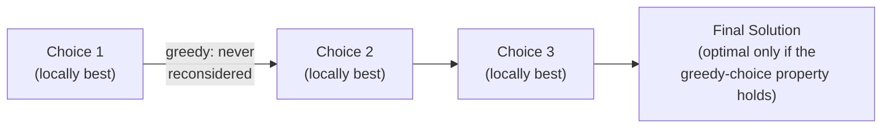
*Unlike DP (section 13), greedy never backtracks or reconsiders — correctness depends entirely on the problem having the greedy-choice property (section 14), proven via an exchange argument, not just "it seems to work."*

**Activity selection — Definition:** given a set of activities each with a start and end time, select the maximum number that don't overlap — solved optimally and simply by **greedily sorting by end time** and always picking the next activity whose start time is after the previously-selected activity's end — a textbook example of a problem where greedy provably yields the optimal answer.

**Interval scheduling** — the same core idea as activity selection, generalized to related problems: merging overlapping intervals (sort by start time, merge adjacent overlaps in one pass), minimum number of meeting rooms needed (track overlapping-interval count over time), etc.

**Huffman coding (brief) — Definition:** a greedy algorithm for building an optimal prefix-free binary encoding of a set of symbols, minimizing total encoded length given each symbol's frequency — repeatedly merges the two lowest-frequency nodes (using a min-heap, section 7) into a new combined node, building a binary tree bottom-up — the classical example connecting greedy algorithms and heaps.

**Proving greedy correctness (exchange argument, brief) — Definition:** the standard technique for proving a greedy strategy is actually optimal — assume there's an optimal solution that differs from the greedy one at some point, show that "exchanging" that differing choice for the greedy choice doesn't make the solution any worse, and conclude the greedy solution is (at least) equally optimal — a formal justification, since "seems intuitively reasonable" is not sufficient grounds to trust a greedy approach without this kind of proof (or a known, established result).

**Practice problems:**

```js
// 1. Jump Game — greedily track the farthest reachable index, O(n)
function canJump(nums) {
  let farthest = 0;
  for (let i = 0; i < nums.length; i++) {
    if (i > farthest) return false;
    farthest = Math.max(farthest, i + nums[i]);
  }
  return true;
}

// 2. Jump Game II (minimum jumps) — greedy level-by-level expansion, O(n)
function jump(nums) {
  let jumps = 0, currentEnd = 0, farthest = 0;
  for (let i = 0; i < nums.length - 1; i++) {
    farthest = Math.max(farthest, i + nums[i]);
    if (i === currentEnd) { jumps++; currentEnd = farthest; }
  }
  return jumps;
}

// 3. Gas Station — greedy single pass; if total gas ≥ total cost, a valid start always exists
function canCompleteCircuit(gas, cost) {
  let total = 0, tank = 0, start = 0;
  for (let i = 0; i < gas.length; i++) {
    const diff = gas[i] - cost[i];
    total += diff; tank += diff;
    if (tank < 0) { start = i + 1; tank = 0; } // this segment can't be a valid start
  }
  return total >= 0 ? start : -1;
}

// 4. Merge Intervals (recap, greedy framing) — sort by start, greedily extend/merge, O(n log n)
function mergeGreedy(intervals) {
  intervals.sort((a, b) => a[0] - b[0]);
  const result = [];
  for (const interval of intervals) {
    if (!result.length || result[result.length - 1][1] < interval[0]) result.push(interval);
    else result[result.length - 1][1] = Math.max(result[result.length - 1][1], interval[1]);
  }
  return result;
}

// 5. Partition Labels — greedily extend a partition's end to the last occurrence of every char seen so far
function partitionLabels(s) {
  const lastIndex = {};
  for (let i = 0; i < s.length; i++) lastIndex[s[i]] = i;
  const result = [];
  let start = 0, end = 0;
  for (let i = 0; i < s.length; i++) {
    end = Math.max(end, lastIndex[s[i]]);
    if (i === end) { result.push(end - start + 1); start = i + 1; }
  }
  return result;
}
```

---

## 15. Bit Manipulation

**Binary representation basics — Definition:** every integer is stored in memory as a fixed-width sequence of bits (0s and 1s); understanding this representation unlocks operations that are dramatically faster than their arithmetic equivalents, and unlocks compact set/state representations (bitmasking, section 13).

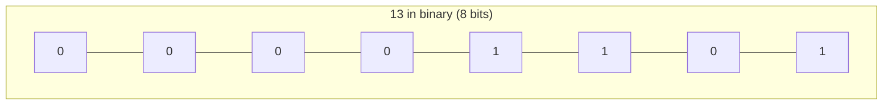
*13 = `00001101` — bit 0 (value 1) and bit 2 (value 4) and bit 3 (value 8) are set: 1+4+8=13. `isSet(13, 2)` checks bit 2 directly via `13 & (1 << 2)`.*

**Bitwise operators:**

```
&   AND  — 1 only if both bits are 1
|   OR   — 1 if either bit is 1
^   XOR  — 1 if exactly one bit is 1 (differ)
~   NOT  — flips every bit
<<  left shift  — multiply by 2 per shift
>>  right shift — divide by 2 per shift (integer division)
```

**Common bit tricks:**

```js
// check if bit i is set
const isSet = (n, i) => (n & (1 << i)) !== 0;

// set bit i
const setBit = (n, i) => n | (1 << i);

// clear bit i
const clearBit = (n, i) => n & ~(1 << i);

// count set bits (Brian Kernighan's algorithm — O(number of set bits), not O(bit width))
function countSetBits(n) {
  let count = 0;
  while (n) { n &= (n - 1); count++; } // clears the lowest set bit each iteration
  return count;
}

// power of two check — a power of two has exactly one bit set
const isPowerOfTwo = (n) => n > 0 && (n & (n - 1)) === 0;
```

**XOR tricks — Definition:** XOR's key properties — `x ^ x = 0` and `x ^ 0 = x`, and it's commutative/associative — make it useful for: finding the single non-duplicated element in an array where every other element appears twice (XOR everything together; all pairs cancel to 0, leaving the unique element), and swapping two variables without a temporary variable.

```js
// find the single number that appears once, where every other appears twice
function singleNumber(nums) {
  return nums.reduce((acc, n) => acc ^ n, 0);
}
```

**Bitmasking for subsets/state representation** — see section 13's state compression; representing "which elements of a small set are included" as the bits of a single integer, enabling fast subset iteration/comparison and compact DP state.

**Practice problems:**

```js
// 1. Number of 1 Bits (Hamming Weight) — Brian Kernighan's trick, O(number of set bits)
function hammingWeight(n) {
  let count = 0;
  while (n !== 0) { n &= (n - 1); count++; }
  return count;
}

// 2. Single Number II — every element appears 3 times except one; bit-counting per position, O(32n)
function singleNumberII(nums) {
  let result = 0;
  for (let bit = 0; bit < 32; bit++) {
    let sum = 0;
    for (const n of nums) sum += (n >> bit) & 1;
    if (sum % 3 !== 0) result |= (1 << bit);
  }
  return result;
}

// 3. Counting Bits — DP + bit trick: count[i] = count[i >> 1] + (i & 1), O(n)
function countBits(n) {
  const result = new Array(n + 1).fill(0);
  for (let i = 1; i <= n; i++) result[i] = result[i >> 1] + (i & 1);
  return result;
}

// 4. Sum of Two Integers without + or - — bitwise addition using XOR (sum) and AND+shift (carry)
function getSum(a, b) {
  while (b !== 0) {
    const carry = (a & b) << 1;
    a = a ^ b;
    b = carry;
  }
  return a;
}

// 5. Subsets via Bitmask — iterate every bitmask from 0 to 2ⁿ-1, each representing one subset, O(n · 2ⁿ)
function subsetsBitmask(nums) {
  const n = nums.length, result = [];
  for (let mask = 0; mask < (1 << n); mask++) {
    const subset = [];
    for (let i = 0; i < n; i++) if (mask & (1 << i)) subset.push(nums[i]);
    result.push(subset);
  }
  return result;
}
```

---

## 16. Tries & Advanced String Structures

**Trie (prefix tree) — Definition:** a tree structure specialized for storing strings, where each edge represents one character, and any path from the root spells out a prefix — all strings sharing a common prefix share the same path from the root, which is what makes prefix-based operations efficient: **O(L)** time (where `L` is the string/prefix length) for insert, search, and prefix search, entirely independent of how many total strings are stored.

```js
class TrieNode {
  constructor() { this.children = {}; this.isEndOfWord = false; }
}
class Trie {
  constructor() { this.root = new TrieNode(); }
  insert(word) {
    let node = this.root;
    for (const ch of word) {
      if (!node.children[ch]) node.children[ch] = new TrieNode();
      node = node.children[ch];
    }
    node.isEndOfWord = true;
  }
  search(word) {
    let node = this.root;
    for (const ch of word) {
      if (!node.children[ch]) return false;
      node = node.children[ch];
    }
    return node.isEndOfWord;
  }
  startsWith(prefix) {
    let node = this.root;
    for (const ch of prefix) {
      if (!node.children[ch]) return false;
      node = node.children[ch];
    }
    return true;
  }
}
```

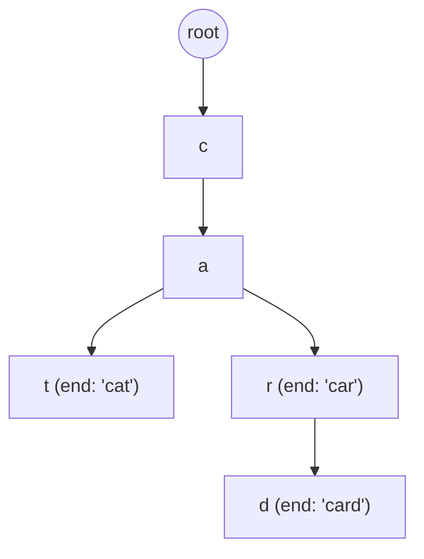
*Inserting "cat", "car", "card" — they share the "ca" prefix path, diverging only where the words actually differ. Searching any of them is O(word length), independent of how many total words are stored.*

**Trie use cases** — autocomplete/typeahead suggestions (see the System Design notes' autocomplete case study — this is exactly the underlying data structure), spell checkers, and IP routing (longest-prefix matching).

**Suffix arrays/trees (brief) — Definition:** structures indexing **every suffix** of a string, enabling very fast substring search, longest-repeated-substring, and longest-common-substring queries across large texts — more powerful (and more complex to build) than a trie of individual words, used in specialized text-processing/bioinformatics applications.

**String matching algorithms — Definition:**
- **Naive matching** — checks every possible starting position in the text for a match against the pattern — O(n × m) worst case (`n` = text length, `m` = pattern length).
- **KMP (Knuth-Morris-Pratt)** — precomputes a "failure function" for the pattern (how far to safely skip ahead on a mismatch, based on the pattern's own internal repeated structure), avoiding re-examining text characters already known to match — O(n + m).
- **Rabin-Karp** — uses a rolling hash to compare the pattern's hash against a sliding window's hash across the text, only falling back to a full character comparison when hashes match (a candidate, possibly a hash collision) — average O(n + m), and particularly well-suited to searching for *multiple* patterns simultaneously.

**Practice problems:**

```js
// 1. Implement Trie (Prefix Tree) — recap section 16's core structure; insert/search/startsWith all O(L)
// (see the Trie/TrieNode classes already defined above in this section)

// 2. Word Search II — Trie + grid backtracking, finding multiple words efficiently in one grid traversal
function findWords(board, words) {
  const trie = new Trie();
  for (const w of words) trie.insert(w);
  const rows = board.length, cols = board[0].length, found = new Set();
  function dfs(r, c, node, path) {
    if (r < 0 || c < 0 || r >= rows || c >= cols || board[r][c] === '#') return;
    const ch = board[r][c];
    if (!node.children[ch]) return;
    node = node.children[ch];
    path += ch;
    if (node.isEndOfWord) found.add(path);
    board[r][c] = '#';
    dfs(r + 1, c, node, path); dfs(r - 1, c, node, path); dfs(r, c + 1, node, path); dfs(r, c - 1, node, path);
    board[r][c] = ch;
  }
  for (let r = 0; r < rows; r++) for (let c = 0; c < cols; c++) dfs(r, c, trie.root, '');
  return [...found];
}

// 3. Longest Word in Dictionary (built via Trie) — a word is valid only if every prefix is also a word
function longestWord(words) {
  const trie = new Trie();
  for (const w of words) trie.insert(w);
  let best = '';
  function isBuildable(word) {
    let node = trie.root;
    for (const ch of word) {
      node = node.children[ch];
      if (!node.isEndOfWord) return false; // every prefix must itself be a complete word
    }
    return true;
  }
  for (const w of words) {
    if (isBuildable(w) && (w.length > best.length || (w.length === best.length && w < best))) best = w;
  }
  return best;
}

// 4. Repeated DNA Sequences (Rabin-Karp-style rolling hash) — find all 10-letter substrings occurring more than once
function findRepeatedDnaSequences(s) {
  const seen = new Set(), repeated = new Set();
  for (let i = 0; i + 10 <= s.length; i++) {
    const sub = s.slice(i, i + 10);
    if (seen.has(sub)) repeated.add(sub);
    seen.add(sub);
  }
  return [...repeated];
}

// 5. Implement strStr() (needle in haystack) — naive O(n·m); KMP would improve to O(n+m) (section 16)
function strStr(haystack, needle) {
  if (!needle.length) return 0;
  for (let i = 0; i + needle.length <= haystack.length; i++) {
    if (haystack.slice(i, i + needle.length) === needle) return i;
  }
  return -1;
}
```

---

## 17. Union-Find (Disjoint Set Union)

**Definition:** Union-Find (DSU) is a data structure that tracks a collection of disjoint (non-overlapping) sets, supporting two core operations efficiently: `find(x)` (which set does `x` belong to, represented by a "representative"/root element) and `union(x, y)` (merge the sets containing `x` and `y`) — the standard tool for problems about dynamic connectivity — "are these two elements in the same group," where the groups themselves change over time via merges.

```js
class UnionFind {
  constructor(n) {
    this.parent = Array.from({ length: n }, (_, i) => i);
    this.rank = new Array(n).fill(0);
  }
  find(x) {
    if (this.parent[x] !== x) this.parent[x] = this.find(this.parent[x]); // path compression
    return this.parent[x];
  }
  union(x, y) {
    const rootX = this.find(x), rootY = this.find(y);
    if (rootX === rootY) return;
    // union by rank — attach smaller tree under the larger tree's root
    if (this.rank[rootX] < this.rank[rootY]) this.parent[rootX] = rootY;
    else if (this.rank[rootX] > this.rank[rootY]) this.parent[rootY] = rootX;
    else { this.parent[rootY] = rootX; this.rank[rootX]++; }
  }
}
```

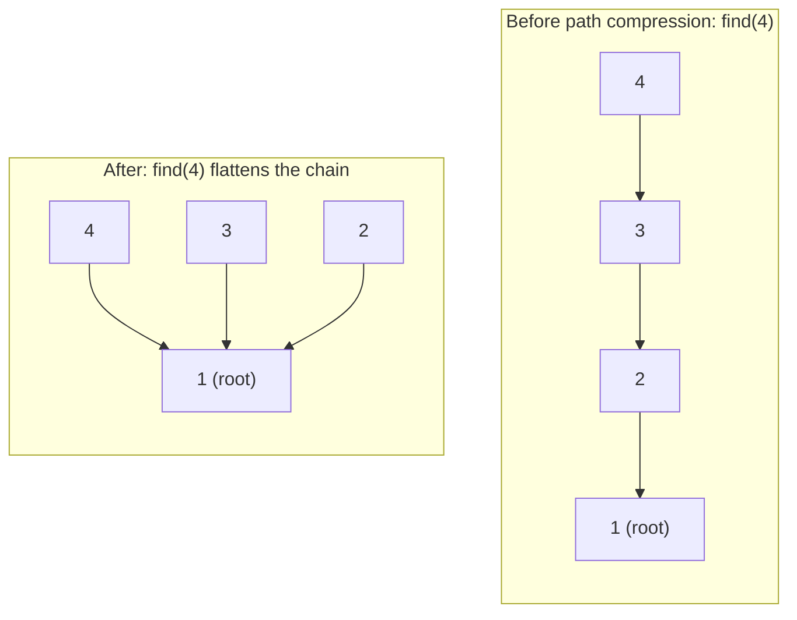
*`find(4)` walking up to the root (1) rewires every node it passed through to point directly at the root — the next `find` on any of them is O(1).*

**Union by rank/size — Definition:** when merging two sets, always attach the smaller/shallower tree under the root of the larger/deeper one, rather than arbitrarily — prevents the merged structure from becoming a long, degenerate chain, keeping tree height logarithmic.

**Path compression — Definition:** during `find(x)`, after locating the ultimate root, repoint every node visited along the way directly to that root — future `find` calls on those nodes become O(1), flattening the tree structure over time.

**Time complexity (inverse Ackermann) — Definition:** combining both union by rank *and* path compression gives amortized time per operation of **O(α(n))**, where α is the inverse Ackermann function — a function that grows so slowly it's effectively constant (well under 5) for any `n` that could realistically occur in practice, even though it's not, technically, a true constant.

**Common applications** — Kruskal's MST algorithm (section 8, using `union`/`find` to detect whether adding an edge would create a cycle), counting connected components (each `union` call merges two components; final count = number of distinct roots), and cycle detection in an undirected graph (an edge between two nodes already in the same set indicates a cycle).

**Practice problems:**

```js
// 1. Number of Connected Components in an Undirected Graph — union all edges, count distinct roots, O(E·α(n))
function countComponents(n, edges) {
  const uf = new UnionFind(n);
  for (const [a, b] of edges) uf.union(a, b);
  return new Set(Array.from({ length: n }, (_, i) => uf.find(i))).size;
}

// 2. Redundant Connection (find the extra edge creating a cycle) — union edges one by one, O(E·α(n))
function findRedundantConnection(edges) {
  const uf = new UnionFind(edges.length + 1);
  for (const [a, b] of edges) {
    if (uf.find(a) === uf.find(b)) return [a, b]; // already connected — this edge creates the cycle
    uf.union(a, b);
  }
  return [];
}

// 3. Accounts Merge — union accounts sharing an email, then group by root, O(n·α(n))
function accountsMerge(accounts) {
  const uf = new UnionFind(accounts.length);
  const emailToAccount = new Map();
  accounts.forEach((account, i) => {
    for (let j = 1; j < account.length; j++) {
      const email = account[j];
      if (emailToAccount.has(email)) uf.union(i, emailToAccount.get(email));
      else emailToAccount.set(email, i);
    }
  });
  const groups = new Map();
  for (const [email, i] of emailToAccount) {
    const root = uf.find(i);
    if (!groups.has(root)) groups.set(root, new Set());
    groups.get(root).add(email);
  }
  return [...groups.entries()].map(([root, emails]) => [accounts[root][0], ...[...emails].sort()]);
}

// 4. Graph Valid Tree — n nodes with n-1 edges, all connected, and no cycle (Union-Find detects both)
function validTree(n, edges) {
  if (edges.length !== n - 1) return false; // a tree on n nodes has exactly n-1 edges
  const uf = new UnionFind(n);
  for (const [a, b] of edges) {
    if (uf.find(a) === uf.find(b)) return false; // cycle detected
    uf.union(a, b);
  }
  return true;
}

// 5. Kruskal's MST (recap section 8) — sort edges by weight, union unless it creates a cycle, O(E log E)
function kruskalMST(n, edges) {
  edges.sort((a, b) => a[2] - b[2]); // [u, v, weight]
  const uf = new UnionFind(n);
  let totalWeight = 0, edgesUsed = 0;
  for (const [u, v, w] of edges) {
    if (uf.find(u) !== uf.find(v)) { uf.union(u, v); totalWeight += w; edgesUsed++; }
  }
  return edgesUsed === n - 1 ? totalWeight : -1; // -1 if the graph isn't fully connectable
}
```

---

## 18. Advanced Trees & Range Query Structures

**Balanced BSTs (AVL, Red-Black — conceptual) — Definition:** self-balancing binary search trees that automatically perform rotations after insertions/deletions to maintain a height bound of O(log n), guaranteeing O(log n) search/insert/delete even in the worst case (unlike a plain BST, section 6, which can degrade to O(n)). **AVL trees** enforce a strict balance (heights of left/right subtrees of any node differ by at most 1), giving faster lookups but more rotation overhead on writes; **Red-Black trees** enforce a looser balance (via node coloring rules), giving faster writes at the cost of slightly less-tight balance — Red-Black trees are the more common choice in standard library implementations (e.g. underlying C++'s `std::map`, Java's `TreeMap`) due to their better write performance.

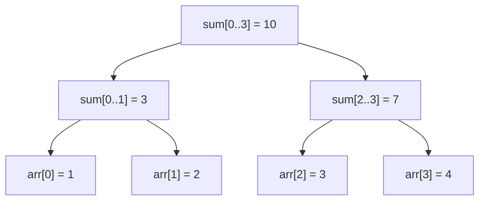
*Each internal node aggregates its children's range — querying `sum(0,3)` reads the root directly in O(1); updating `arr[1]` only needs to fix the O(log n) nodes on the path back to the root, not the whole array.*

**Segment tree — Definition:** a binary tree structure where each node represents an aggregate (sum, min, max) over a **range** of the underlying array, with leaves representing individual elements — enables both **range queries** (e.g. "sum of elements from index 3 to 17") and **point updates** in O(log n), a significant improvement over a plain prefix-sum array (section 2), which answers range queries in O(1) but requires O(n) to handle a single update (since every subsequent prefix sum shifts).

```js
class SegmentTree {
  constructor(arr) {
    this.n = arr.length;
    this.tree = new Array(2 * this.n);
    for (let i = 0; i < this.n; i++) this.tree[this.n + i] = arr[i];
    for (let i = this.n - 1; i > 0; i--) this.tree[i] = this.tree[2 * i] + this.tree[2 * i + 1];
  }
  update(i, val) {
    i += this.n;
    this.tree[i] = val;
    while (i > 1) { i = Math.floor(i / 2); this.tree[i] = this.tree[2 * i] + this.tree[2 * i + 1]; }
  }
  queryRangeSum(l, r) { // [l, r)
    let sum = 0;
    for (l += this.n, r += this.n; l < r; l = Math.floor(l / 2), r = Math.floor(r / 2)) {
      if (l % 2 === 1) sum += this.tree[l++];
      if (r % 2 === 1) sum += this.tree[--r];
    }
    return sum;
  }
}
```

**Lazy propagation (brief) — Definition:** an optimization for segment trees supporting **range updates** (e.g. "add 5 to every element from index 3 to 17") efficiently — instead of eagerly propagating an update down to every affected leaf immediately (which would be O(n)), the update is stashed at the highest relevant node and only pushed further down lazily, when a later query/update actually needs to descend past that node — keeps both range updates and range queries at O(log n).

**Fenwick tree (Binary Indexed Tree) — Definition:** a more compact, array-based structure (no explicit tree nodes) that supports prefix-sum queries and point updates in O(log n), using clever bit manipulation (each index is responsible for a range determined by its lowest set bit) — simpler to implement and more memory-efficient than a segment tree, but less flexible (naturally suited to sum-like/invertible operations; a segment tree handles min/max and other non-invertible aggregates more directly).

**Choosing between segment tree, Fenwick tree, and prefix sums:**

| Need | Structure |
|---|---|
| Static array, only range queries, no updates | Prefix sums (O(1) query, O(n) build) |
| Range sum queries + point updates | Fenwick tree (simplest, smallest memory) |
| Range min/max/other aggregate + point updates | Segment tree |
| Range updates + range queries | Segment tree with lazy propagation |

**Practice problems:**

```js
// 1. Range Sum Query — Immutable (prefix sums, recap section 2) — O(1) query after O(n) build
class NumArray {
  constructor(nums) {
    this.prefix = [0];
    for (const n of nums) this.prefix.push(this.prefix[this.prefix.length - 1] + n);
  }
  sumRange(left, right) { return this.prefix[right + 1] - this.prefix[left]; }
}

// 2. Range Sum Query — Mutable (Fenwick tree / Binary Indexed Tree) — O(log n) update and query
class FenwickTree {
  constructor(n) { this.n = n; this.tree = new Array(n + 1).fill(0); }
  update(i, delta) { for (i++; i <= this.n; i += i & (-i)) this.tree[i] += delta; }
  prefixSum(i) { let sum = 0; for (i++; i > 0; i -= i & (-i)) sum += this.tree[i]; return sum; }
  rangeSum(left, right) { return this.prefixSum(right) - (left > 0 ? this.prefixSum(left - 1) : 0); }
}

// 3. Count of Smaller Numbers After Self — Fenwick tree over rank-compressed values, O(n log n)
function countSmaller(nums) {
  const sorted = [...new Set(nums)].sort((a, b) => a - b);
  const rank = new Map(sorted.map((v, i) => [v, i]));
  const fenwick = new FenwickTree(sorted.length);
  const result = new Array(nums.length).fill(0);
  for (let i = nums.length - 1; i >= 0; i--) {
    const r = rank.get(nums[i]);
    result[i] = r > 0 ? fenwick.prefixSum(r - 1) : 0;
    fenwick.update(r, 1);
  }
  return result;
}

// 4. Validate a Balanced BST height check (recap AVL concept) — verify height-balance invariant, O(n)
function isBalanced(root) {
  function height(node) {
    if (!node) return 0;
    const left = height(node.left);
    if (left === -1) return -1;
    const right = height(node.right);
    if (right === -1) return -1;
    if (Math.abs(left - right) > 1) return -1;
    return 1 + Math.max(left, right);
  }
  return height(root) !== -1;
}

// 5. Range Sum Query 2D — Immutable — 2D prefix sums, O(1) query after O(rows·cols) build
class NumMatrix {
  constructor(matrix) {
    const rows = matrix.length, cols = matrix[0].length;
    this.prefix = Array.from({ length: rows + 1 }, () => new Array(cols + 1).fill(0));
    for (let r = 0; r < rows; r++)
      for (let c = 0; c < cols; c++)
        this.prefix[r + 1][c + 1] = matrix[r][c] + this.prefix[r][c + 1] + this.prefix[r + 1][c] - this.prefix[r][c];
  }
  sumRegion(r1, c1, r2, c2) {
    return this.prefix[r2 + 1][c2 + 1] - this.prefix[r1][c2 + 1] - this.prefix[r2 + 1][c1] + this.prefix[r1][c1];
  }
}
```

---

## 19. Common Problem-Solving Patterns

**Two pointers (recap)** — see section 2; two indices scanning toward/away from each other, typically on sorted data.

**Sliding window (recap)** — see section 2; a contiguous, incrementally-adjusted subrange, for "best contiguous subarray/substring" problems.

**Fast & slow pointers (recap)** — see section 3; two pointers moving at different speeds, for cycle detection and finding a linked list's middle in one pass.

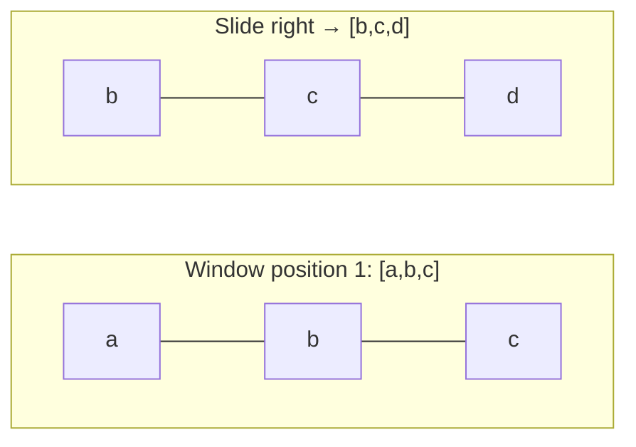
*The window slides one element at a time — reusing the overlap (b, c) from the previous position rather than recomputing it from scratch, turning an O(n²) brute force into O(n).*

**Merge intervals — Definition:** a pattern for problems involving overlapping ranges — sort intervals by start time, then scan once, merging the current interval into the previous one whenever they overlap — O(n log n), dominated by the initial sort.

**Cyclic sort — Definition:** a technique for arrays known to contain values in a fixed range `[1, n]` (or `[0, n-1]`) — repeatedly swap each element into its "correct" index position (`value`'s correct index is `value - 1`) — achieves O(n) sorting/placement (beating the O(n log n) comparison-sort bound) by exploiting the known, constrained value range, and is the basis for O(n) "find the missing/duplicate number in range [1,n]" problems.

**Top-K elements (heap-based) — Definition:** to find the `k` largest (or smallest) elements among `n`, maintain a heap of size `k` (a min-heap for "k largest" — the heap's root is always the smallest of the current top-k candidates, discarded first if a bigger element arrives) rather than sorting the entire array — O(n log k), better than O(n log n) full sort when `k` is small relative to `n`.

**Matrix traversal patterns** — common shapes: row-by-row/column-by-column scanning, spiral traversal, and BFS/DFS on a grid treating each cell as a graph node connected to its (typically 4 or 8) neighbors — the grid-graph mental model unifies many "island counting," "shortest path in a maze," and "flood fill" problems under the standard BFS/DFS template (section 8).

**Backtracking template (recap)** — see section 11; "choose → explore → un-choose."

**BFS/DFS template (recap)** — see section 8; the queue-based level-by-level (BFS) vs stack/recursion-based depth-first (DFS) traversal skeletons, reused across trees, graphs, and grids alike.

**Practice problems:**

```js
// 1. 3Sum — sort + two pointers per fixed first element, O(n²)
function threeSum(nums) {
  nums.sort((a, b) => a - b);
  const result = [];
  for (let i = 0; i < nums.length - 2; i++) {
    if (i > 0 && nums[i] === nums[i - 1]) continue; // skip duplicates
    let left = i + 1, right = nums.length - 1;
    while (left < right) {
      const sum = nums[i] + nums[left] + nums[right];
      if (sum === 0) {
        result.push([nums[i], nums[left], nums[right]]);
        while (left < right && nums[left] === nums[left + 1]) left++;
        while (left < right && nums[right] === nums[right - 1]) right--;
        left++; right--;
      } else sum < 0 ? left++ : right--;
    }
  }
  return result;
}

// 2. Find All Duplicates in an Array (cyclic sort pattern) — O(n) time, O(1) extra space
function findDuplicates(nums) {
  const result = [];
  for (let i = 0; i < nums.length; i++) {
    const idx = Math.abs(nums[i]) - 1;
    if (nums[idx] < 0) result.push(idx + 1);
    else nums[idx] = -nums[idx]; // mark as seen by negating
  }
  return result;
}

// 3. K Closest Points to Origin (top-K pattern) — max-heap of size k, O(n log k)
function kClosest(points, k) {
  return points
    .map(p => [p, p[0] * p[0] + p[1] * p[1]])
    .sort((a, b) => a[1] - b[1])
    .slice(0, k)
    .map(([p]) => p);
}

// 4. Rotate Image (matrix traversal pattern) — transpose then reverse each row, in-place O(n²)
function rotate(matrix) {
  const n = matrix.length;
  for (let i = 0; i < n; i++)
    for (let j = i + 1; j < n; j++)
      [matrix[i][j], matrix[j][i]] = [matrix[j][i], matrix[i][j]]; // transpose
  for (const row of matrix) row.reverse();
}

// 5. Spiral Matrix (matrix traversal pattern) — shrinking boundary traversal, O(rows × cols)
function spiralOrder(matrix) {
  const result = [];
  let top = 0, bottom = matrix.length - 1, left = 0, right = matrix[0].length - 1;
  while (top <= bottom && left <= right) {
    for (let c = left; c <= right; c++) result.push(matrix[top][c]);
    top++;
    for (let r = top; r <= bottom; r++) result.push(matrix[r][right]);
    right--;
    if (top <= bottom) { for (let c = right; c >= left; c--) result.push(matrix[bottom][c]); bottom--; }
    if (left <= right) { for (let r = bottom; r >= top; r--) result.push(matrix[r][left]); left++; }
  }
  return result;
}
```

---

## 20. Interview Preparation & Complexity Cheat Sheet

**Approaching an unseen problem — Definition:** a structured process for tackling an unfamiliar problem under interview conditions: restate the problem in your own words, work through a small concrete example by hand, identify what data structure/pattern the problem's shape suggests (section 19), start with a brute-force solution if a better one isn't immediately obvious, then optimize — rather than attempting to jump straight to an optimal solution from a blank state.

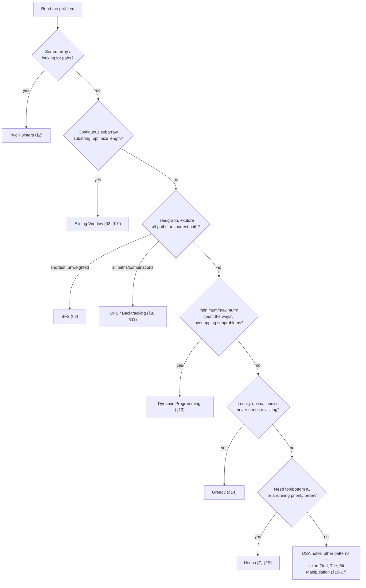
*A rough triage flow — not exhaustive, but a starting decision path for "what pattern is this, really" when a new problem doesn't immediately announce its category.*

**Clarifying constraints & edge cases** — input size (which determines what time complexity is actually acceptable — see the table below), value ranges, duplicate handling, empty/null input, and whether the input is sorted — the same discipline as clarifying requirements in a system design interview (see the System Design notes' section 17), applied at the algorithm-problem scale.

**Communicating your approach** — narrating your reasoning (why this data structure, why this complexity is acceptable given the constraints, what edge case you're now handling) throughout, not just silently arriving at working code — the reasoning process is generally what's actually being evaluated.

**Complexity cheat sheet (common data structure operations):**

| Structure | Access | Search | Insert | Delete |
|---|---|---|---|---|
| Array | O(1) | O(n) | O(n) | O(n) |
| Dynamic Array (push/pop end) | O(1) | O(n) | O(1)* | O(1)* |
| Linked List | O(n) | O(n) | O(1)† | O(1)† |
| Hash Table | — | O(1) avg | O(1) avg | O(1) avg |
| Balanced BST | O(log n) | O(log n) | O(log n) | O(log n) |
| Heap | O(1) (peek only) | O(n) | O(log n) | O(log n) (root only) |

*amortized. †given a reference to the node/position.

**Common mistakes & how to avoid them** — off-by-one errors in loop bounds/binary search midpoints (mitigated by carefully tracing a small example); forgetting edge cases (empty input, single element, all-duplicate values); not considering whether the input is sorted (missing an opportunity for two-pointers/binary search); assuming the naive brute-force complexity is acceptable without checking it against the stated input-size constraints.

**Practicing effectively (patterns over problem count)** — recognizing that a new problem is "a sliding window problem" or "this is 0/1 knapsack in disguise" transfers far more than memorizing the solution to any individual problem — deliberately practicing across the pattern categories in section 19 (and this roadmap's structure generally) builds that pattern-recognition far more efficiently than solving many problems within just one already-familiar category.

**Practice problems (mixed, cross-topic — a mini mock interview set):**

```js
// 1. Best Time to Buy and Sell Stock — single pass tracking the minimum price seen so far, O(n)
function maxProfit(prices) {
  let minPrice = Infinity, maxProfit = 0;
  for (const price of prices) {
    minPrice = Math.min(minPrice, price);
    maxProfit = Math.max(maxProfit, price - minPrice);
  }
  return maxProfit;
}

// 2. Trapping Rain Water — two pointers tracking left/right max height, O(n) time, O(1) space
function trap(height) {
  let left = 0, right = height.length - 1, leftMax = 0, rightMax = 0, water = 0;
  while (left < right) {
    if (height[left] < height[right]) {
      leftMax = Math.max(leftMax, height[left]);
      water += leftMax - height[left];
      left++;
    } else {
      rightMax = Math.max(rightMax, height[right]);
      water += rightMax - height[right];
      right--;
    }
  }
  return water;
}

// 3. Design a rate limiter (sliding window log) — combines section 4's queue/deque with section 2's sliding window
class RateLimiter {
  constructor(maxRequests, windowMs) { this.max = maxRequests; this.window = windowMs; this.log = []; }
  allowRequest(now = Date.now()) {
    while (this.log.length && this.log[0] <= now - this.window) this.log.shift();
    if (this.log.length < this.max) { this.log.push(now); return true; }
    return false;
  }
}

// 4. Serialize and Deserialize Binary Tree (recap section 6) — pre-order with null markers, O(n)
function serialize(root) {
  const result = [];
  function preorder(node) {
    result.push(node ? String(node.val) : '#');
    if (node) { preorder(node.left); preorder(node.right); }
  }
  preorder(root);
  return result.join(',');
}
function deserialize(data) {
  const values = data.split(',');
  let i = 0;
  function build() {
    const val = values[i++];
    if (val === '#') return null;
    const node = new TreeNode(Number(val));
    node.left = build();
    node.right = build();
    return node;
  }
  return build();
}

// 5. LFU Cache (harder variant of section 5's LRU) — hash maps tracking frequency buckets, O(1) get/put
class LFUCache {
  constructor(capacity) {
    this.capacity = capacity;
    this.minFreq = 0;
    this.keyToVal = new Map();
    this.keyToFreq = new Map();
    this.freqToKeys = new Map(); // freq -> insertion-ordered Set of keys (Map preserves order in JS)
  }
  _touch(key) {
    const freq = this.keyToFreq.get(key);
    this.freqToKeys.get(freq).delete(key);
    if (!this.freqToKeys.get(freq).size && freq === this.minFreq) this.minFreq++;
    this.keyToFreq.set(key, freq + 1);
    if (!this.freqToKeys.has(freq + 1)) this.freqToKeys.set(freq + 1, new Set());
    this.freqToKeys.get(freq + 1).add(key);
  }
  get(key) {
    if (!this.keyToVal.has(key)) return -1;
    this._touch(key);
    return this.keyToVal.get(key);
  }
  put(key, value) {
    if (this.capacity <= 0) return;
    if (this.keyToVal.has(key)) { this.keyToVal.set(key, value); this._touch(key); return; }
    if (this.keyToVal.size >= this.capacity) {
      const evictKey = this.freqToKeys.get(this.minFreq).values().next().value;
      this.freqToKeys.get(this.minFreq).delete(evictKey);
      this.keyToVal.delete(evictKey); this.keyToFreq.delete(evictKey);
    }
    this.keyToVal.set(key, value); this.keyToFreq.set(key, 1); this.minFreq = 1;
    if (!this.freqToKeys.has(1)) this.freqToKeys.set(1, new Set());
    this.freqToKeys.get(1).add(key);
  }
}
```
