# Operating Systems — Deep Dive Roadmap

We'll go from OS fundamentals → process & memory management → file systems & I/O → concurrency & synchronization → the boot process → building your own OS from scratch → advanced topics & interview prep.

*This file covers operating systems both as a theoretical foundation (how Linux/Windows/macOS actually work under the hood) and as something you can build yourself — a minimal, from-scratch toy kernel. Cross-references the C++ notes (the language virtually every real OS kernel is written in), the DSA notes (schedulers/memory allocators are concrete data-structure applications), the Java notes (the JVM as a runtime built on top of OS abstractions), and the CLI notes (the shell as a userspace program talking to the kernel via system calls).*

---

## 1. Operating System Fundamentals

**Definition:** an operating system is the software layer sitting between raw hardware and every application running on a machine — it abstracts hardware complexity behind consistent, general-purpose interfaces (a filesystem instead of raw disk sectors, a process instead of raw CPU time, a socket instead of raw network frames), manages shared hardware resources fairly and safely among multiple simultaneously-running programs, and enforces isolation so one program's failure or misbehavior can't (in a well-designed OS) corrupt or crash another's.

**Kernel vs userspace — the privilege boundary — Definition:** the **kernel** is the OS's core — the only code running with full, unrestricted hardware access (privileged/"kernel mode" CPU execution) — everything else, including ordinary applications and even much of the OS's own supporting tooling, runs in **userspace**, a deliberately restricted execution mode that cannot directly access hardware or arbitrary memory — this hardware-enforced privilege boundary (implemented via CPU-level privilege rings, section 16) is precisely what prevents an ordinary, buggy or malicious application from directly corrupting the kernel or another process's memory — any userspace code needing a privileged operation (reading a file, allocating memory, sending a network packet) must explicitly request it from the kernel via a **system call** (below), never perform it directly.

**Monolithic vs microkernel architecture — Definition:** a **monolithic kernel** (Linux, the traditional Unix design) runs the vast majority of OS services — the scheduler, memory management, filesystem drivers, device drivers — all within the single, unified kernel address space, in kernel mode; a **microkernel** (seL4, and historically Minix) keeps the kernel itself minimal — scheduling and IPC (section 2) only — pushing filesystem and device-driver code out into separate userspace processes that communicate with the minimal kernel via message passing — the tradeoff is genuinely consequential: a monolithic kernel's in-kernel drivers/services run faster (no IPC overhead between kernel and driver) but a bug in any one of them can crash the entire kernel; a microkernel isolates a driver crash to just that one userspace service, at the cost of the message-passing overhead for every operation that would otherwise be a direct in-kernel function call — Linux's real-world dominance is a strong practical argument for the monolithic approach's performance advantage outweighing microkernel purity in most contexts, though the debate remains genuinely alive in OS design circles.

**System calls — how userspace requests kernel services — Definition:** a **system call** (`syscall`) is the sole, controlled mechanism by which userspace code can request the kernel perform a privileged operation on its behalf — invoked via a special CPU instruction that deliberately triggers a controlled transition from user mode to kernel mode (not an ordinary function call, since userspace code cannot simply jump into kernel code directly) — `read()`, `write()`, `fork()`, `mmap()` are all system calls; every higher-level library function a program actually calls (`fopen()` in C, `open()` in Python) is, underneath, ultimately built on top of these same raw system calls — this is the exact mechanism by which the CLI notes' shell commands, and every program covered across this entire workspace, actually interacts with files, processes, and the network at all.

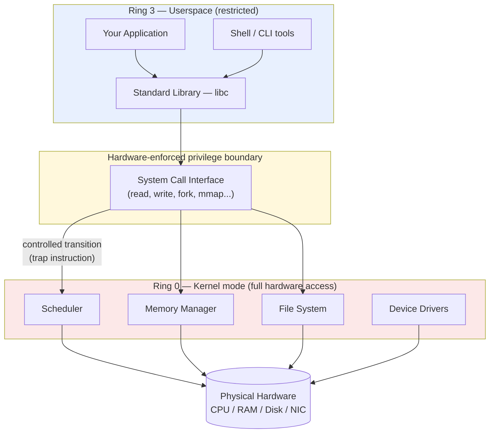

---

## 2. Processes & Process Management

**What a process actually is — Definition:** a **process** is a running instance of a program — critically, **not** the same thing as the program's executable file on disk — a process comprises its own private **address space** (memory the process believes it exclusively owns, section 6's virtual memory making this illusion possible even on shared physical hardware), its current execution state (CPU register values, the program counter), and open resource handles (open files, network sockets) — the kernel tracks each process's state in a **PCB (Process Control Block)**, a kernel data structure holding everything needed to pause a process and later resume it exactly where it left off — the same "represent runnable state as data the scheduler can save/restore" principle directly underlying section 4's context-switching mechanism.

**Process states & lifecycle — Definition:** a process moves through a defined set of states — **new** (being created), **ready** (waiting for the CPU, able to run immediately once scheduled), **running** (actively executing on a CPU core right now), **waiting/blocked** (waiting on an event — I/O completion, a lock, section 7 — genuinely unable to make progress even if given the CPU), **terminated** (finished, awaiting cleanup) — the scheduler (section 4) is fundamentally responsible for transitioning processes between ready and running; a process in the blocked state, by definition, cannot be usefully scheduled at all until whatever it's waiting on completes.

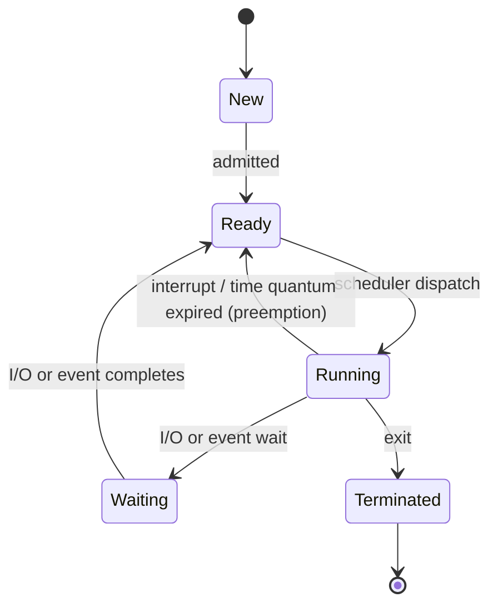

**Process creation: `fork`/`exec` vs `CreateProcess` — Definition:** Unix-family systems (Linux, macOS) create a new process via the distinctive two-step **`fork()`/`exec()`** pattern — `fork()` creates an near-identical **copy** of the calling process (same code, same memory contents, a new PCB and PID) — both the original and the copy continue executing from the exact same point immediately after the `fork()` call returns, distinguishable only by `fork()`'s return value (0 in the child, the child's PID in the parent); `exec()` then **replaces** the calling process's own memory image with a different program entirely, without creating a new process — the common "start a new program" pattern is `fork()` followed immediately by `exec()` in the child, letting the shell (CLI notes) fork itself and have the child replace itself with the actual command being run, while the parent shell process continues unaffected; Windows instead uses a single, more direct `CreateProcess()` call that does both steps atomically — a genuinely different, less flexible-but-more-direct design philosophy, reflecting the two operating systems' broader historical divergence in process-management philosophy.

```c
#include <unistd.h>
pid_t pid = fork();
if (pid == 0) {
    execl("/bin/ls", "ls", "-la", NULL); // child: replace this process's image with `ls`
} else {
    wait(NULL); // parent: wait for the child to finish
}
```

**Inter-Process Communication (IPC) — Definition:** since each process has its own isolated address space (a deliberate, security-relevant design choice, section 1), processes needing to exchange data must use explicit, kernel-mediated **IPC** mechanisms — **pipes** (a unidirectional byte stream between related processes, the exact mechanism the CLI notes' `|` operator is built on at the kernel level); **shared memory** (the kernel maps the *same* physical memory pages into multiple processes' address spaces — the fastest IPC mechanism, since no data copying through the kernel is needed at all, at the cost of the processes needing their own explicit synchronization, section 7, to avoid racing on the shared data); **message queues** (structured, discrete messages passed through the kernel); **sockets** (the same networking abstraction covered in the Communication notes, usable for IPC between processes on the same machine too, not only across a network) — each trades off throughput, complexity, and whether the communicating processes need to be related (parent/child) or can be entirely unrelated.

---

## 3. Threads & Concurrency

**Threads vs processes — shared address space, the tradeoff (recap Java/Python/C++ notes) — Definition:** a **thread** is an independent execution path *within* a single process, sharing that process's address space and open resources with every other thread in the same process — the same concurrency-primitive concept already covered concretely for Java (`Thread`, Java notes' section 11), Python (`threading`, Python notes' section 10), and C++ (`std::thread`, C++ notes' section 11) — the shared address space is both threading's central advantage (no IPC needed to communicate — threads simply read/write the same memory directly) and its central danger (uncoordinated concurrent access to shared memory is exactly the data-race problem each of those language-specific concurrency sections already covers, requiring the synchronization primitives in section 7 below) — creating a new thread is also meaningfully cheaper than `fork()`-ing an entirely new process, since no new address space needs to be set up at all.

**Kernel threads vs user threads, 1:1 vs M:N models — Definition:** a **kernel thread** is scheduled directly by the OS kernel's own scheduler (section 4), visible to and independently manageable by the kernel; a **user thread** is managed entirely by a userspace library, invisible to the kernel, which only ever sees the single underlying process — the **1:1 model** (used by modern Linux/most mainstream systems) maps every user-visible thread directly to one kernel thread — simple, and lets the kernel scheduler genuinely parallelize threads across multiple CPU cores, at the cost of every thread creation/context-switch paying full kernel-level overhead; the **M:N model** maps many user threads onto a smaller number of kernel threads, with a userspace scheduler multiplexing them — this is precisely the underlying model behind Java's newer **virtual threads** (Java notes' section 14) and Go's goroutines, letting an application juggle vastly more logical threads than the 1:1 model's kernel-thread overhead would practically permit.

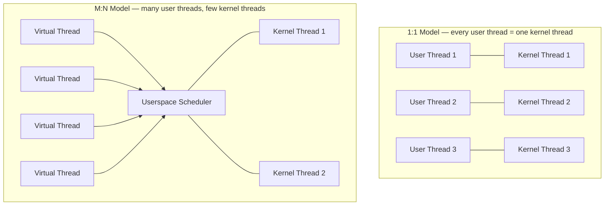
*The 1:1 model (left) pays full kernel-level overhead per thread. M:N (right — Java virtual threads, Go goroutines) multiplexes many cheap logical threads onto a small, fixed pool of real kernel threads.*

**Process vs thread memory model — Definition:** the reason two threads can communicate simply by reading/writing a shared variable, while two processes need explicit IPC (section 2), comes down entirely to what each one owns privately versus shares:

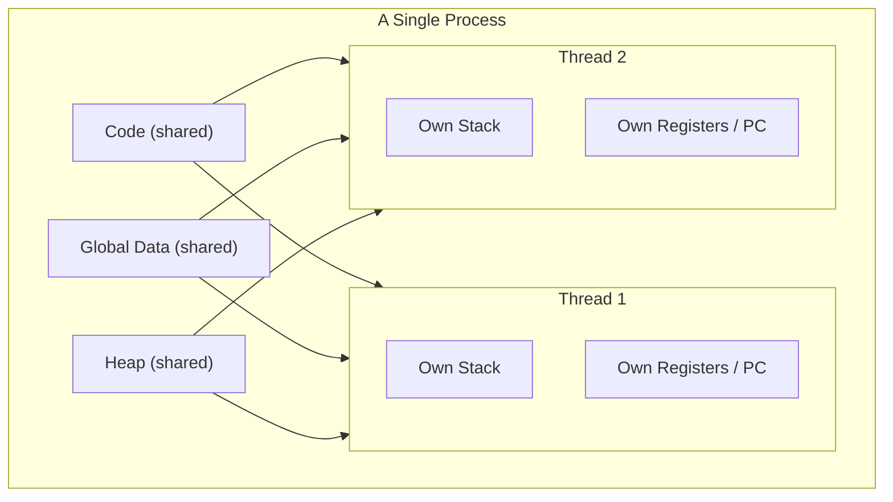
*Threads within one process share code, global data, and the heap — only the stack and CPU register state are private per thread, which is exactly why uncoordinated access to shared heap/global data across threads causes the race conditions section 7 covers.*

**Context switching — what actually happens, and its cost — Definition:** a **context switch** saves a currently-running thread/process's complete CPU state (registers, program counter, stack pointer) into its PCB (section 2), then loads a different one's previously-saved state, resuming it exactly where it left off — this is genuinely not free: it costs direct CPU cycles to save/restore state, and indirectly costs even more through **cache pollution** — the CPU's fast caches were "warm" with the previous thread's working data, and the newly-scheduled thread starts with cold caches, needing to reload data from slower main memory — this cost is precisely why excessive, unnecessary context switching (an overly aggressive scheduler, or an application spawning far more threads than available CPU cores can usefully run in parallel) is a genuine, measurable performance concern, not merely a theoretical one.

**Multithreading models & why the GIL/thread-per-core debates exist (recap Python notes) — Definition:** CPython's GIL (Global Interpreter Lock, already covered in depth in the Python notes' section 8) is a language-runtime-level decision layered *on top of* the OS's own 1:1 thread model — the OS happily schedules Python's OS-level threads across multiple cores exactly like any other thread, but CPython's own GIL then serializes actual Python bytecode execution among them regardless — this is a crucial distinction worth internalizing precisely here: the OS-level threading model (this section) and a language runtime's own additional concurrency constraints (Python's GIL, Java notes' section 8's discussion of free-threaded builds removing an analogous constraint) are two genuinely separate layers, and understanding OS-level threading is what makes it clear the GIL is a CPython implementation choice, not some inherent limitation of "threads" as an OS concept.

---

## 4. CPU Scheduling

**Scheduling goals — Definition:** a CPU scheduler decides which ready process/thread (section 2) actually gets to run on an available CPU core at any given moment — balancing several often-competing goals: **throughput** (total work completed per unit time), **latency/response time** (how quickly a specific request gets handled, particularly critical for interactive workloads), **fairness** (no process starved indefinitely while others repeatedly run), and **starvation avoidance** specifically (a low-priority process that keeps getting preempted by higher-priority arrivals must eventually still get to run) — no single scheduling algorithm optimizes all of these simultaneously, which is precisely why real-world schedulers (this section's CFS case study) are deliberately engineered compromises rather than a single "obviously correct" algorithm.

**Scheduling algorithms — Definition:**
- **FCFS (First-Come, First-Served)** — processes run strictly in arrival order, to completion — simple, but a single long-running process can block many short ones behind it indefinitely (the "convoy effect"), badly hurting average response time.
- **SJF (Shortest Job First)** — always runs whichever ready process has the shortest remaining execution time — provably optimal for minimizing average waiting time, but requires knowing (or accurately predicting) each process's future runtime in advance, which is generally impossible for genuinely unpredictable, general-purpose workloads.
- **Round Robin** — each process gets a fixed **time quantum** before being preempted and cycled to the back of the ready queue — good fairness and response time, with the quantum size as a critical tuning knob (too short: excessive context-switch overhead, section 3; too long: degrades toward FCFS's poor responsiveness).
- **Priority scheduling** — always runs the highest-priority ready process — directly susceptible to **starvation** (a low-priority process might never run if higher-priority processes keep arriving) unless combined with **aging** (gradually increasing a waiting process's effective priority the longer it waits, guaranteeing it eventually runs).
- **Multilevel Feedback Queue (MLFQ)** — multiple priority queues, each with its own time quantum, with a process's queue **dynamically adjusted** based on its observed behavior (a process using its full quantum repeatedly is demoted toward lower-priority, longer-quantum queues, favoring CPU-bound work; a process that frequently blocks for I/O quickly is kept at higher priority, favoring interactive responsiveness) — genuinely adapts to a process's actual observed behavior rather than requiring it be known in advance, directly addressing SJF's core impracticality.

**Preemptive vs non-preemptive scheduling — Definition:** a **preemptive** scheduler can forcibly interrupt a currently-running process before it voluntarily yields the CPU (via a timer interrupt, section 9) — the model virtually every modern general-purpose OS uses, since it guarantees no single misbehaving or long-running process can monopolize a CPU core indefinitely; a **non-preemptive** (cooperative) scheduler only switches when the running process voluntarily yields (blocks for I/O, or explicitly relinquishes the CPU) — simpler to reason about but fundamentally fragile, since one process failing to yield can hang the entire system — largely a historical/embedded-systems approach today rather than a mainstream desktop/server OS design.

**Real-world scheduler case study: Linux's CFS — Definition:** Linux's **Completely Fair Scheduler** doesn't use a fixed time quantum at all — instead, it tracks each runnable task's accumulated **virtual runtime** (CPU time actually consumed, weighted by priority) and always selects whichever runnable task has the *least* accumulated virtual runtime — implemented via a **red-black tree** (the exact same balanced-BST data structure already covered generically in the DSA notes' section 18 and concretely for Java's `TreeMap`/C++'s `std::map`) keyed by virtual runtime, giving O(log n) selection of "the task that's fallen furthest behind its fair share" — a genuinely elegant, concrete real-world application of a data structure this workspace has already covered abstractly, directly illustrating that "fairness" in CFS's specific sense means every runnable task converges toward an equal share of CPU time over any given interval, weighted by its configured priority ("niceness").

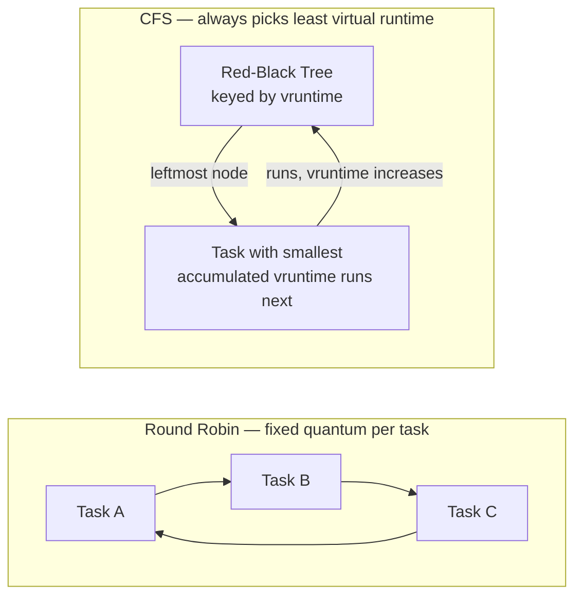

---

## 5. Memory Management Fundamentals

**Address spaces — logical vs physical addresses — Definition:** a **logical (virtual) address** is the address a running process's own code actually uses and sees — entirely independent of where that data is *actually* physically located in RAM; a **physical address** is the real, literal location in the machine's physical memory chips — the kernel (specifically, hardware assisted via the MMU, section 6) translates every logical address a process uses into the correct physical address transparently — this indirection is precisely what makes it possible for every process to believe it has its own private memory starting at some consistent address, even though many processes simultaneously share the same finite physical RAM underneath.

**Contiguous allocation, fragmentation — Definition:** early, simpler memory-management schemes allocated each process a single **contiguous** block of physical memory — straightforward, but suffers from **external fragmentation** (as processes are created and destroyed over time, memory becomes a patchwork of allocated and free regions, and even though the *total* free memory might be sufficient for a new request, no single free region might be large enough, since it's scattered in small, non-contiguous chunks); **internal fragmentation** is the related-but-distinct problem of allocating a fixed-size block larger than what's actually needed, wasting the unused remainder within an allocated block — this exact contiguous-allocation fragmentation problem is the direct motivation behind paging (below), which sidesteps it entirely by never requiring contiguous physical allocation in the first place.

**Paging — dividing memory into fixed-size frames — Definition:** **paging** divides a process's logical address space into fixed-size **pages** (commonly 4KB) and physical memory into equally-sized **frames** — any page can be mapped to any free frame, **anywhere** in physical memory, entirely eliminating the external-fragmentation problem contiguous allocation suffers from, since pages never need to be physically adjacent to each other at all — the tradeoff is the need for a **page table** (section 6) to track each page's current frame mapping, and some remaining internal fragmentation (a process's last, partially-used page still wastes the unused portion of that fixed-size page) — the dominant memory-management approach in essentially every modern general-purpose OS.

**Segmentation — dividing memory into logical, variable-size units — Definition:** **segmentation** divides an address space into variable-size, logically-meaningful segments (a code segment, a data segment, a stack segment) rather than paging's fixed-size, logically-arbitrary chunks — more naturally aligned with how a program is actually structured, but reintroduces the external-fragmentation problem contiguous allocation had, since segments themselves are variable-size — modern systems (x86-64, Linux) have largely moved away from segmentation as a primary memory-management mechanism, using paging instead, though vestigial segmentation support remains present at the hardware level for backward compatibility and specific, narrow uses (like establishing initial memory protection during the boot process, section 12).

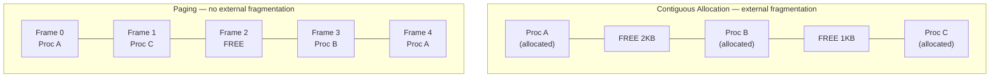
*Contiguous allocation (top): 3KB of free memory exists, but scattered in two chunks — a 3KB request still fails. Paging (bottom): any process's pages can occupy any free frame anywhere, so scattered free frames are just as usable as adjacent ones.*

---

## 6. Virtual Memory

**Why virtual memory exists — Definition:** **virtual memory** builds on paging (section 5) to give every process the illusion of its own large, private, contiguous address space — starting from the same predictable logical address range regardless of what's actually happening in physical memory — providing two distinct, critical benefits simultaneously: **isolation** (one process's virtual addresses cannot accidentally or maliciously reach another process's physical memory, since the mapping is entirely controlled by the kernel), and the appearance of **more memory than physically exists** (via demand paging and swapping to disk, below), letting a system run more/larger processes than its actual physical RAM alone could hold simultaneously.

**Page tables & address translation, the TLB — Definition:** a **page table** is the kernel-maintained data structure mapping each of a process's virtual pages to its current physical frame (or marking it as not-currently-present, below) — every single memory access a process makes requires this translation, which would be prohibitively slow if it always required a full page-table lookup (itself a memory access) on every other memory access — the **TLB (Translation Lookaside Buffer)** is a small, extremely fast hardware cache specifically for recently-used virtual-to-physical translations, checked first on every memory access — a **TLB hit** avoids the full page-table walk entirely; a **TLB miss** requires the slower full lookup — this is precisely why the cache-locality principles already discussed generally in the C++/Java notes' performance sections matter doubly at the OS level: poor memory-access locality also means a higher TLB miss rate, compounding a program's actual performance cost beyond just CPU cache misses alone.

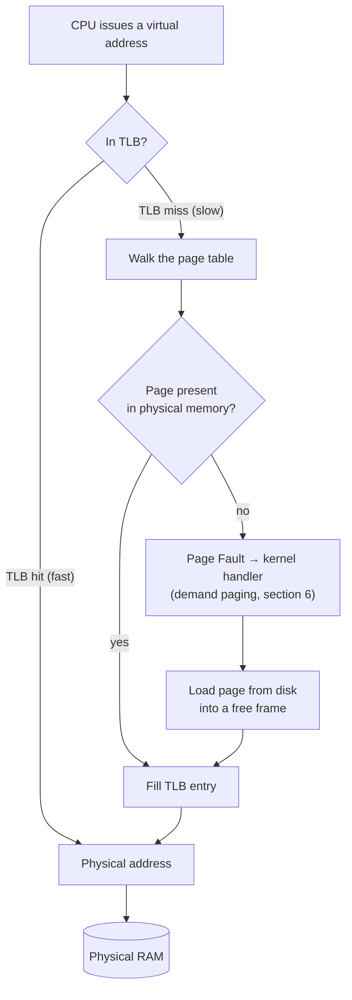

**Page faults & demand paging — Definition:** a **page fault** occurs when a process accesses a virtual page currently marked not-present in physical memory — triggering a hardware interrupt (section 9) that hands control to the kernel's page-fault handler; **demand paging** deliberately exploits this mechanism as a *feature*, not just an error condition — a process's pages aren't all loaded into physical memory upfront when it starts; each page is loaded lazily, only the first time it's actually accessed, triggering an initial page fault the kernel resolves by reading it in from disk — this is why a large program can start running almost immediately even though only a small fraction of its total code/data has actually been loaded into physical memory yet, and why the first access to any given part of a program is measurably, if usually imperceptibly, slower than subsequent accesses to that same already-resident page.

**Page replacement algorithms — Definition:** when physical memory is full and a page fault requires bringing in a new page, some **currently-resident** page must be evicted (written back to disk if modified, a process called **swapping**) to make room — **FIFO** evicts whichever page was loaded longest ago, simple but can perform surprisingly poorly (even paradoxically worse with *more* physical memory in specific pathological cases, known as Bélády's anomaly); **LRU (Least Recently Used)** evicts whichever resident page hasn't been accessed for the longest time — generally much better in practice, since real programs exhibit **locality of reference** (recently-accessed data is disproportionately likely to be accessed again soon, the exact same principle already covered for CPU caches in the C++ notes' section 14) making LRU a genuinely good predictor of future access; **Optimal** (evict whichever page won't be needed for the longest time in the future) is provably the best possible algorithm but requires knowing the future, making it purely a theoretical benchmark other algorithms are measured against, never actually implementable; **Clock** is a practical, efficient approximation of LRU (a circular buffer of pages with a "reference bit" cleared/checked as a hand sweeps around it) avoiding the overhead of tracking exact access recency for every single page, which true LRU would require.

---

## 7. Synchronization & Concurrency Control

**The critical section problem — Definition:** a **critical section** is a code region accessing shared, mutable state (section 3's threading discussion) — the **critical section problem** is designing a mechanism guaranteeing that at most one thread executes within a critical section at any given time (**mutual exclusion**), that no thread waits indefinitely to enter (**progress/no starvation**), and that the solution doesn't assume anything about relative thread speeds — this is the exact, formal statement of the problem the synchronization primitives below (and already covered concretely in the Java/Python/C++ notes' respective concurrency sections) exist specifically to solve.

**Mutexes, semaphores, condition variables (recap C++/Java concurrency notes) — Definition:** a **mutex** (mutual exclusion lock) allows only one thread to hold it at a time, directly implementing the critical-section problem's mutual-exclusion requirement — the same `std::mutex`/`synchronized` primitive already covered concretely in the C++ notes' section 11 and Java notes' section 11; a **semaphore** generalizes this to allow up to **N** threads simultaneously (a **counting semaphore**), useful for limiting concurrent access to a resource pool of size N (e.g. a fixed number of database connections) rather than strict single-thread exclusivity; a **condition variable** lets a thread efficiently **wait** for a specific condition to become true (rather than wastefully polling/spinning in a loop checking it repeatedly), and lets another thread **signal** waiters once that condition changes — the OS-level mechanism directly underlying the higher-level coordination primitives (`CountDownLatch`, `Semaphore`) already covered in the Java notes' section 12.

**Deadlock: the four necessary conditions, prevention, avoidance, detection — Definition:** a **deadlock** occurs when a set of threads/processes are each waiting on a resource held by another in the same set, forming a cycle with no thread able to proceed — the same fundamental problem already covered concretely for Java (Java notes' section 11) and C++ (C++ notes' section 11) — formally requires **four simultaneous conditions**: **mutual exclusion** (resources can't be shared), **hold and wait** (a thread holds one resource while waiting for another), **no preemption** (a resource can't be forcibly taken away), and **circular wait** (a cycle of threads each waiting on the next) — breaking **any single one** of these four conditions prevents deadlock entirely, which is precisely why the standard, most practical prevention strategy is enforcing a fixed, global lock-acquisition **order** across an entire codebase (directly eliminating the circular-wait condition specifically, already stated as the practical fix in the Java notes' section 11) — **deadlock avoidance** algorithms (like the Banker's Algorithm) attempt to dynamically avoid entering an unsafe state at all, while **deadlock detection** allows deadlocks to occur but periodically checks for and recovers from them (typically by forcibly terminating one of the deadlocked processes) — avoidance/detection are more theoretically complete but considerably more complex than the simple, practical "always acquire locks in a fixed order" prevention strategy most real systems actually rely on.

**Classic synchronization problems — Definition:** the **Producer-Consumer** problem (producers add items to a shared, bounded buffer; consumers remove them; both must correctly handle the buffer being full or empty, directly modeling the same bounded-queue coordination underlying real message-queue systems, Communication notes' section 10); the **Readers-Writers** problem (many readers can safely access shared data simultaneously, but a writer needs exclusive access — modeling the common real-world pattern where read access vastly outnumbers writes, and naive mutual exclusion would unnecessarily serialize read-only access that's actually perfectly safe to parallelize); the **Dining Philosophers** problem (five philosophers alternately think and eat, needing two shared forks to eat, directly illustrating how a naive, symmetric resource-acquisition strategy can deadlock — every philosopher picks up their left fork simultaneously, then waits forever for their right — a concrete, intuitive illustration of the circular-wait condition above) — all three are canonical, decades-old teaching problems specifically because each illustrates a genuinely distinct concurrency-control challenge with direct, real-world analogues.


*Every philosopher holds their left fork and waits on their right — a circular wait, the fourth necessary condition for deadlock. Breaking the cycle (e.g. one philosopher picks up their right fork first) prevents it.*

---

## 8. File Systems

**What a file system actually is — Definition:** a **file system** is the abstraction layer translating a disk's raw, undifferentiated sequence of numbered blocks into the familiar hierarchical structure of files and directories applications and users actually interact with — without a file system, a disk is simply an enormous flat array of fixed-size blocks with no inherent concept of "files" at all; the file system is entirely responsible for tracking which blocks belong to which file, in what order, and organizing that into the named, hierarchical structure every OS presents.

**File system structures: inodes, directories, allocation methods — Definition:** an **inode** (in Unix-family file systems) is a data structure holding a file's metadata — size, permissions (CLI notes' section 2's POSIX permission model, implemented and stored here), timestamps, and — critically — pointers to the actual data blocks containing the file's content — notably, an inode does **not** store the file's name at all; a **directory** is itself just a special file mapping names to inode numbers, which is precisely why a "hard link" (multiple directory entries pointing to the same inode) is possible: the name and the actual file content/metadata are genuinely separate concepts; **allocation methods** determine how a file's data blocks are actually tracked — **contiguous** (fast sequential access, but suffers the exact external-fragmentation problem section 5 covers), **linked** (each block points to the next, eliminating fragmentation but with poor random-access performance, the same access-pattern tradeoff already covered generically for linked lists in the DSA notes' section 3), and **indexed** (a dedicated index block lists all of a file's data blocks — what modern inodes actually use, giving reasonably efficient random access without contiguous-allocation's fragmentation cost).

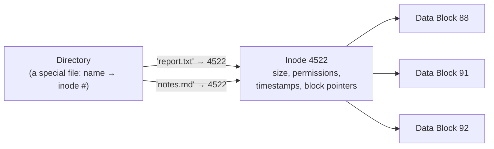
*Two different directory entries ("report.txt" and "notes.md") both point to the same inode — a hard link. Both names are equally "real"; deleting one leaves the file, and the other name, fully intact until the last link is removed.*

**Common file systems: ext4, NTFS, APFS — Definition:** **ext4** (Linux's dominant default) is a journaling (below), inode-based file system evolved from a long lineage of earlier Unix file systems; **NTFS** (Windows's default since Windows NT) uses a Master File Table rather than traditional inodes, with built-in support for features like file compression and detailed ACL-based permissions (a richer, more granular permission model than the POSIX-permission bits ext4 relies on, directly connecting to the CLI notes' section 2 observation that Windows's permission model has no direct POSIX equivalent); **APFS** (Apple's modern default, replacing the older HFS+) is optimized specifically for flash/SSD storage characteristics and includes native, efficient snapshot and clone support — each represents a genuinely different set of design priorities (Unix heritage and simplicity, Windows-ecosystem feature richness, modern flash-storage optimization) rather than one being simply "better" than the others in an absolute sense.

**Journaling — how file systems survive a crash mid-write — Definition:** a **journal** is a dedicated log area where a file system records its **intended** changes *before* actually applying them to the main file system structures — if a crash or power loss occurs mid-operation, the file system can replay the journal on next mount to either complete or cleanly roll back the interrupted operation, rather than being left in a genuinely inconsistent, potentially unrecoverable state — the exact same write-ahead-logging principle already covered generally for database durability in the SQL/Database notes, here applied to file system metadata specifically — journaling is precisely why a modern journaling file system recovers gracefully and near-instantly from an unclean shutdown, versus older, non-journaling file systems that required a slow, full-disk consistency check (`fsck`) after every unclean shutdown, with no guarantee of full recovery even then.

---

## 9. I/O Systems & Device Management

**The I/O subsystem — device drivers, the kernel/hardware boundary — Definition:** a **device driver** is kernel (or, in a microkernel, section 1, userspace) code specifically implementing the interface between the OS's generic I/O abstractions (read/write a block device, send/receive network packets) and one particular piece of hardware's actual, idiosyncratic control interface — this driver layer is precisely what lets application code (and even most of the rest of the kernel) remain entirely hardware-agnostic, calling the same generic `read()`/`write()` system calls (section 1) regardless of whether the underlying device is an SSD, a USB drive, or a network card, with the driver translating that generic request into the specific commands that particular hardware actually understands.

**Polling vs interrupts vs DMA — Definition:** **polling** has the CPU repeatedly check a device's status register in a loop, wasting CPU cycles on a device that isn't yet ready most of the time; an **interrupt** lets a device instead proactively **signal** the CPU the instant it's actually ready (data arrived, an operation completed) — the CPU can do other useful work in the meantime and only handle the device when there's genuinely something to do, at the cost of the interrupt-handling overhead (a context switch into a kernel interrupt handler, section 3) — the dominant approach in virtually all modern general-purpose I/O; **DMA (Direct Memory Access)** goes a step further specifically for bulk data transfer — letting a device controller transfer data **directly to/from main memory**, entirely bypassing the CPU for the actual data-copying itself, with the CPU only interrupted once the *entire* transfer completes rather than needing to shepherd every individual byte through itself — essential for high-throughput devices (disks, network cards) where CPU-mediated byte-by-byte transfer would be a severe, unacceptable bottleneck.

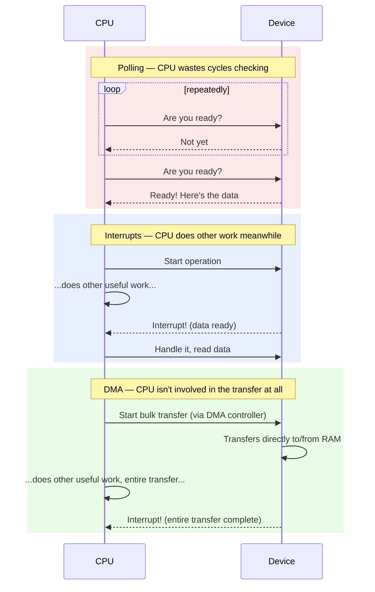

**Buffering, caching, and spooling — Definition:** **buffering** temporarily holds data in memory to smooth out speed mismatches between a fast producer and a slower consumer (or vice versa) — writing to a slow disk is typically buffered in memory first, letting the writing application continue immediately rather than blocking on the disk's actual, much slower completion; **caching** (the page cache, holding recently-accessed disk blocks in memory) exploits locality of reference (section 6) to avoid repeatedly re-reading the same disk data — this is precisely why a second read of the same file is typically dramatically faster than the first: it's very likely already sitting in the OS's page cache in RAM, never touching the actual disk at all; **spooling** queues output destined for a slow, exclusive-access device (the classic example being a printer) so multiple processes can "print" without needing to coordinate direct, serialized access to the physical device themselves.

**Block devices vs character devices — Definition:** a **block device** (a hard drive, SSD) is accessed in fixed-size chunks ("blocks") and supports random access to any block; a **character device** (a keyboard, a serial port) is accessed as a continuous, unstructured stream of individual bytes/characters, typically sequential-only — this distinction directly shapes how the kernel's I/O subsystem and drivers are structured, since the two device categories have fundamentally different natural access patterns and correspondingly different, specialized driver interfaces within the kernel.

---

## 10. The Boot Process

**BIOS/UEFI — what happens before the OS even loads — Definition:** **BIOS** (Basic Input/Output System, the older standard) or its modern successor **UEFI** (Unified Extensible Firmware Interface) is firmware **built into the motherboard itself** — the very first code that runs when a machine powers on, before any OS-provided code exists in memory at all — it performs a **POST (Power-On Self-Test)** checking basic hardware functionality, initializes essential hardware to a minimally usable state, and then locates and hands control to a **bootloader** (below) — UEFI is a substantial, modern improvement over legacy BIOS, supporting larger disks, faster boot times, and **Secure Boot** (cryptographically verifying the bootloader/kernel haven't been tampered with before executing them — a direct, foundational security control directly relevant to the Ethical Hacking notes' section 16 privilege/trust-boundary discussions).

**The bootloader's job — GRUB, and what "booting" actually means — Definition:** a **bootloader** (GRUB being the dominant one on Linux systems) is a small program whose entire job is loading the actual OS kernel into memory and transferring execution control to it — commonly also presenting a menu (letting a user choose between multiple installed kernels/OSes, directly relevant to dual-boot setups) — the term "booting" itself derives from the self-referential idea of "pulling yourself up by your own bootstraps": each stage (firmware → bootloader → kernel) is deliberately minimal specifically so it can be loaded and executed by the even-more-minimal stage immediately before it, progressively bootstrapping from almost nothing up to a fully capable, running operating system.

**Kernel initialization — from bootloader handoff to a running kernel — Definition:** once the bootloader hands control to the kernel, the kernel must initialize itself from scratch — setting up its own memory management (section 5–6), initializing the interrupt system (section 9), detecting and initializing hardware via drivers (section 9), and finally starting the very first userspace process (traditionally `init` on Unix systems, or `systemd` on most modern Linux distributions) — every subsequent userspace process on the entire running system is, ultimately, a descendant of this single first process, created via the `fork()` mechanism already covered in section 2.

**Boot stages on a modern system, end to end:**

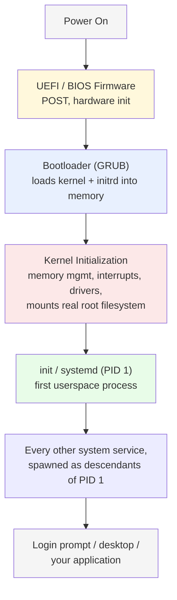

---

## 11. Building Your Own OS — Toolchain & Environment Setup

**Why build a toy OS — what it actually teaches you — Definition:** building even a minimal, extremely limited "toy" OS is one of the most direct ways to genuinely internalize sections 1–10's concepts, since it forces confronting exactly the raw hardware-level problems a real OS solves — you cannot use `malloc()` (there's no C standard library running yet — you *are* the thing that would eventually provide one), you cannot `printf()` to a terminal (there's no terminal driver — you must write directly to video memory yourself), and every abstraction this entire file has discussed (processes, virtual memory, scheduling) must be built, if included at all, entirely from scratch — the learning value is genuinely in the doing, not in producing something resembling a usable, production OS.

**Cross-compilation — why you can't just use your system's normal compiler — Definition:** your regular development machine's compiler (`gcc`, on Linux) is configured by default to produce executables that assume they're running *under* a full host OS — linking against your host OS's standard library, assuming your host OS's executable format, and assuming the specific CPU privilege level (ring 3, userspace, section 16) an ordinary application runs at — a toy OS's kernel needs none of that (it *is* the OS, running at the highest privilege level, ring 0) and must not accidentally link against your host system's standard library at all — a **cross-compiler** is a compiler specifically built to target a different (or differently-configured) environment than the one it itself runs on — the standard, well-documented approach is building a `i686-elf-gcc` (or `x86_64-elf-gcc`) cross-compiler targeting a bare "ELF" executable format with no assumed host OS underneath at all, following the widely-referenced OSDev Wiki's cross-compiler build instructions.

**QEMU — emulating hardware to test your OS without a real machine — Definition:** **QEMU** is a hardware emulator, letting you boot and run your in-development toy OS entirely within a virtual machine on your existing development machine — dramatically faster and safer than the alternative (writing your OS image to a physical USB drive and rebooting real hardware into it after every single change), and providing invaluable debugging capabilities (QEMU can be paused, single-stepped, and connected directly to GDB for genuinely inspecting your kernel's execution instruction-by-instruction) that testing on bare physical hardware simply couldn't offer as conveniently.

```bash
# building and testing a minimal OS image with QEMU
qemu-system-i386 -kernel mykernel.bin
qemu-system-i386 -cdrom myos.iso        # if using GRUB/Multiboot, section 12
```

**Setting up a minimal build environment — Definition:** a typical toy-OS toolchain needs: **NASM** (an x86 assembler, since your bootloader/earliest kernel entry code, section 12, must be written in raw assembly — no C compiler can produce code that runs before basic CPU mode setup is complete), your freshly cross-compiled **GCC** (above, for the majority of your kernel actually written in C, C++ notes), and a **linker script** — a file explicitly telling the linker exactly how to arrange your compiled code and data in the final binary's memory layout (critically important for a kernel, which needs to know and control precisely where in memory it will be loaded, unlike an ordinary userspace program that can rely on the OS's loader and virtual memory to handle this transparently).

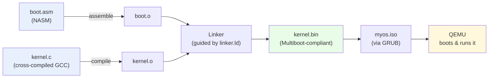

---

## 12. Building Your Own OS — Booting & the Kernel Entry Point

**Writing a minimal bootloader (or using GRUB/Multiboot as a shortcut) — Definition:** writing a genuinely from-scratch x86 bootloader (a 512-byte boot sector, following BIOS's specific expectations) is possible but involves considerable low-level complexity (disk I/O via BIOS interrupts, manually loading further sectors) largely orthogonal to actually learning kernel concepts (sections 1–10) — the standard, widely-recommended practical shortcut is instead making your kernel **Multiboot-compliant** (a standardized specification GRUB, section 10, already implements) — GRUB then handles the entire complex bootloading process for you, loading your kernel binary into memory at a known location and jumping to its entry point, letting you focus your own effort specifically on the kernel itself rather than reimplementing bootloader mechanics GRUB already solves well.

```asm
; a minimal Multiboot header, placed at the very start of the kernel binary
section .multiboot
align 4
    dd 0x1BADB002              ; magic number GRUB looks for
    dd 0x00                    ; flags
    dd -(0x1BADB002 + 0x00)      ; checksum (must make the sum of these three fields exactly zero)
```

**Switching from 16-bit real mode to 32-bit protected mode (x86 specifics) — Definition:** an x86 CPU powers on in **16-bit real mode**, a legacy compatibility mode dating back to the original 8086 processor, with no memory protection and direct, unrestricted access to all memory and I/O — a modern OS needs **32-bit (or 64-bit) protected mode**, which enables the memory protection, privilege rings (section 16), and paging (section 6) a real OS actually depends on — this transition itself requires setting up a **GDT (Global Descriptor Table, a vestige of x86's segmentation heritage, section 5)**, then executing a specific sequence of instructions to actually flip into protected mode — using GRUB/Multiboot (above) conveniently means GRUB has **already performed this transition for you** by the time your kernel's entry point runs, another significant reason it's the recommended starting point rather than a fully hand-rolled bootloader.

**The kernel entry point — from assembly to your first C function — Definition:** your kernel's actual entry point is a small piece of assembly code (referenced by the Multiboot header above) responsible for a few essential setup steps still needed before C code can safely run at all — most critically, setting up an initial **stack** (C function calls fundamentally require a valid stack to push return addresses and local variables onto — C++ notes' section 2 — which doesn't exist automatically the instant GRUB hands off control) — once the stack is set up, the assembly entry point simply calls your actual C kernel's main function, and from that point forward, ordinary C code can run.

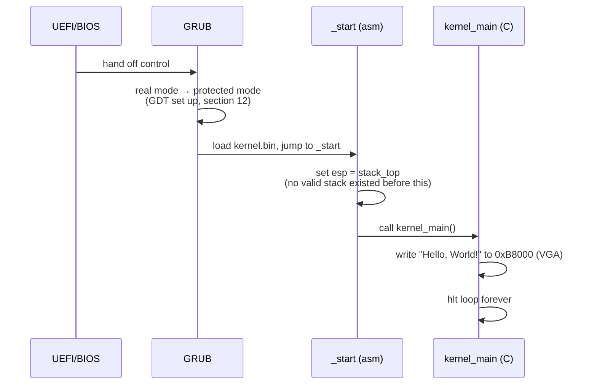

```asm
[bits 32]
section .text
global _start
extern kernel_main

_start:
    mov esp, stack_top      ; set up the stack pointer — required before any C function can run
    call kernel_main          ; hand off to your actual C kernel code
    cli
.hang:
    hlt
    jmp .hang

section .bss
align 16
stack_bottom:
    resb 16384               ; reserve 16KB for the initial kernel stack
stack_top:
```

**Getting "Hello, World" onto the screen via VGA text mode — Definition:** with no display driver, no `printf()`, and no OS underneath you, the simplest way to actually display text is **VGA text mode** — on legacy-compatible x86 hardware (and QEMU's default emulation, section 11), the memory address `0xB8000` is directly, magically mapped to the screen's text display — writing specific byte pairs (a character byte, followed by a color-attribute byte) directly to this memory address immediately makes that character appear on screen, with **no driver, no system call, and no abstraction whatsoever** between your C code and the literal display hardware — genuinely the first moment a toy OS project produces visible, tangible proof that your kernel code is actually running.

```c
void kernel_main(void) {
    volatile char *video_memory = (volatile char*) 0xB8000;
    const char *message = "Hello, World!";
    for (int i = 0; message[i] != '\0'; i++) {
        video_memory[i * 2] = message[i];       // the character byte
        video_memory[i * 2 + 1] = 0x07;             // the color attribute byte (light grey on black)
    }
    for (;;) { __asm__ ("hlt"); }                     // halt the CPU rather than spinning forever
}
```

---

## 13. Building Your Own OS — Core Kernel Subsystems

**Writing a physical memory manager (a simple bitmap allocator) — Definition:** before any dynamic memory allocation is possible, your kernel needs to track which physical memory frames (section 5) are currently free versus in use — a **bitmap allocator** is the simplest practical approach: a single bit per physical frame, `0` meaning free and `1` meaning allocated — allocating a frame means scanning the bitmap for a clear bit and setting it; freeing means clearing the corresponding bit — genuinely simple to implement correctly, if not the most performance-optimized approach real production kernels ultimately use (which employ considerably more sophisticated allocators), making it the right starting point for a learning-focused toy kernel specifically because its correctness is easy to reason about directly.

```c
uint8_t frame_bitmap[MAX_FRAMES / 8];

void set_frame(uint32_t frame) { frame_bitmap[frame / 8] |= (1 << (frame % 8)); }
void clear_frame(uint32_t frame) { frame_bitmap[frame / 8] &= ~(1 << (frame % 8)); }
int test_frame(uint32_t frame) { return frame_bitmap[frame / 8] & (1 << (frame % 8)); }

uint32_t allocate_frame(void) {
    for (uint32_t i = 0; i < MAX_FRAMES; i++) {
        if (!test_frame(i)) { set_frame(i); return i; }
    }
    return -1; // out of physical memory
}
```

**Setting up paging & a virtual memory manager (recap section 6) — Definition:** with a physical memory manager in place, the next step is actually enabling paging — constructing your kernel's own **page tables** (section 6) directly, mapping your kernel's own code/data to a consistent virtual address (conventionally in the upper portion of the address space, leaving lower addresses free for future userspace processes), then loading the page-table base address into the CPU's dedicated register (`CR3` on x86) and setting the specific CPU flag that actually enables paging — from this moment forward, every memory access your kernel makes goes through the virtual-to-physical translation (section 6) you've just configured, rather than addressing physical memory directly the way sections 12–13's earlier code did.

**Interrupt handling — the IDT, handling keyboard input — Definition:** the **IDT (Interrupt Descriptor Table)** is x86's table of handler-function addresses, one entry per possible interrupt number — configuring it (via the `LIDT` instruction) tells the CPU exactly which function to jump to whenever a given interrupt (section 9) occurs — implementing a keyboard interrupt handler specifically (interrupt 33 on the standard legacy PIC configuration) is a classic, genuinely satisfying toy-OS milestone: the keyboard controller raises an interrupt on every keypress, your handler reads the resulting scancode from a specific I/O port, translates it to an actual character, and can then (building directly on section 12's VGA-memory-writing technique) echo it to the screen — the first moment a toy OS becomes genuinely, interactively responsive to real user input rather than just displaying a static, pre-written message.

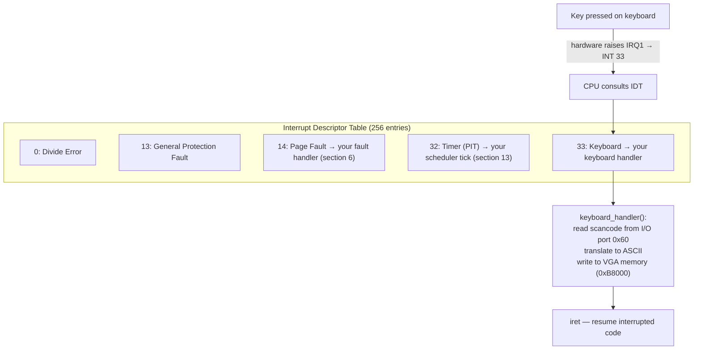

**A minimal round-robin scheduler & basic multitasking — Definition:** implementing even the simplest possible scheduler (section 4's Round Robin, the most straightforward to actually implement) requires: a way to save/restore each task's CPU register state (a minimal PCB, section 2), a **timer interrupt** (configuring the PIT — Programmable Interval Timer — hardware to fire an interrupt at a regular interval, directly triggering your scheduler's context-switch logic, section 3) and the actual context-switch routine itself (assembly code saving the currently-running task's registers to memory, then restoring the next task's previously-saved registers) — achieving genuine, working multitasking (even just switching between two simple, hand-written kernel-level tasks) is the point at which a toy OS project has concretely, directly implemented essentially every core concept from sections 2–4 of this entire file, from the ground up, with your own hands.

---

## 14. Building Your Own OS — Filesystem, Shell & Userspace

**Implementing a minimal in-memory or simple on-disk filesystem — Definition:** a genuinely minimal starting filesystem doesn't need to implement anything as sophisticated as ext4's full inode/journaling model (section 8) — a simple, flat **RAM disk** (a filesystem that exists entirely in memory, initialized from data GRUB loads alongside your kernel as an "initial RAM disk," or `initrd`) or a basic FAT-based on-disk filesystem (simpler to implement correctly than ext4, and well-documented, making it a common toy-OS choice) provides enough of a real filesystem abstraction (files, directories, section 8's core concepts) to build the rest of a minimally usable system on top of.

**Writing a basic shell — the userspace/kernel boundary in your own OS — Definition:** a minimal shell — reading a line of keyboard input (section 13), parsing it into a command name and arguments, and invoking the corresponding action — is genuinely the first piece of software in a toy OS project that meaningfully represents "userspace" as a distinct concept from "kernel," even if, in a sufficiently minimal toy OS, it might still technically run at the same privilege level as the kernel itself rather than genuinely enforcing the ring-0/ring-3 privilege boundary (section 16) a real OS requires — building a *true* userspace/kernel separation (with actual system calls, section 1, crossing a real privilege boundary) is a substantially more advanced step many toy-OS projects deliberately defer or skip entirely, given how much additional complexity it introduces relative to its incremental learning value at the "getting something working" stage.

**System call interface design — how your userspace programs talk to your kernel — Definition:** if a toy OS project does pursue genuine userspace/kernel separation, it needs its own system call mechanism (section 1) — conventionally implemented via a software interrupt (`int 0x80` was Linux's original 32-bit convention) or, on modern x86-64, the dedicated `syscall`/`sysret` instruction pair specifically designed to make this transition faster than a general interrupt — designing even a handful of basic system calls (`write` to display output, `read` to get keyboard input, `exit` to terminate a process) and correctly implementing the actual privilege-mode transition between them is a genuinely advanced, deeply educational milestone directly demonstrating, from first principles, the exact kernel/userspace boundary mechanism section 1 describes abstractly.

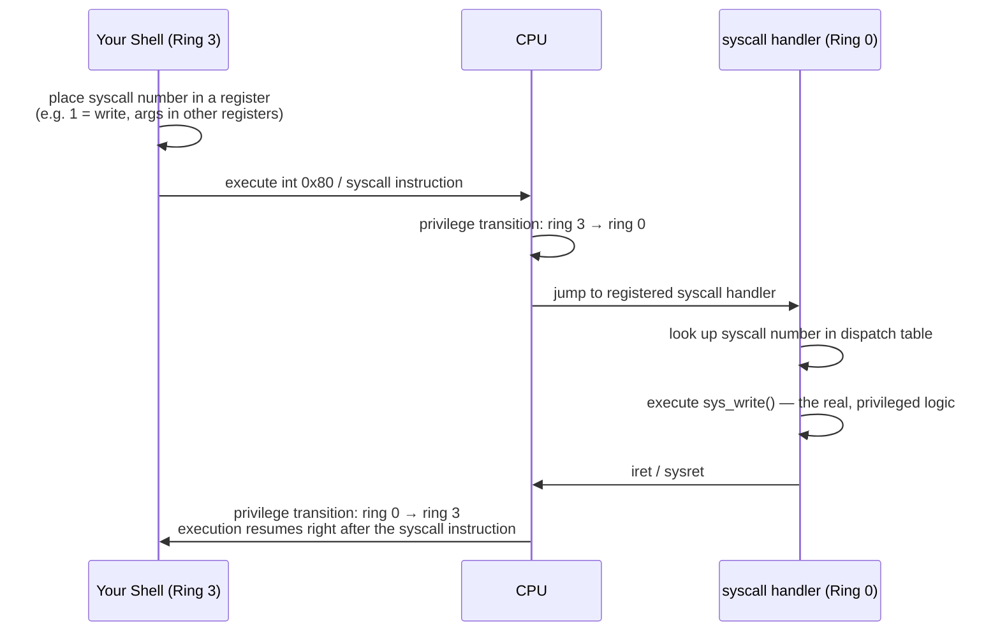

**Where to go from here — what real OS development involves beyond a toy kernel — Definition:** a working toy kernel implementing sections 12–14's milestones has genuinely covered the conceptual core of this entire file hands-on — but a production OS (Linux, at tens of millions of lines of code) additionally involves: robust, general-purpose device drivers for a vast range of real hardware (section 9), a fully general-purpose, POSIX-compliant filesystem and system-call surface, network stack implementation (Communication notes' sections 1–2, implemented from raw Ethernet frames upward), and, critically, extensive security hardening (section 16) — the OSDev Wiki and the "Operating Systems: Three Easy Pieces" textbook (freely available online, widely recommended within the OS-development community) are the standard, well-established next resources for anyone wanting to meaningfully extend a toy kernel project beyond this file's own necessarily introductory scope.

---

## 15. Virtualization & Containers

**Hypervisors — Type 1 vs Type 2, how virtualization actually works — Definition:** a **hypervisor** creates and manages **virtual machines** — each believing it has its own dedicated, complete hardware to itself, while actually sharing the underlying physical machine with other VMs; a **Type 1 (bare-metal)** hypervisor (VMware ESXi, Xen, the AWS notes' EC2 virtualization layer) runs directly on the physical hardware, with no separate host OS underneath it at all — generally better performance and stronger isolation, the standard choice for production server virtualization; a **Type 2 (hosted)** hypervisor (VirtualBox, VMware Workstation, the QEMU already used in section 11) runs as an ordinary application on top of a conventional host OS — simpler to set up, the common choice for local development/testing use, but with an extra layer of overhead the Type 1 model avoids.

**Hardware virtualization support (Intel VT-x/AMD-V) — brief — Definition:** modern CPUs include dedicated hardware virtualization extensions (Intel VT-x, AMD-V) specifically enabling a hypervisor to run guest OS code with near-native performance — without this hardware support, a hypervisor must resort to considerably slower software techniques (binary translation, rewriting privileged instructions on the fly before they execute) to safely virtualize privileged CPU instructions the guest OS attempts to run — this hardware support is precisely why modern virtualization achieves such minimal overhead compared to the software-only virtualization techniques common in earlier virtualization technology.

**Containers vs VMs — why a container isn't "a lightweight VM" (recap Docker-Kubernetes notes) — Definition:** a genuinely important, commonly-blurred distinction worth stating precisely: a **VM** virtualizes an entire machine, including its **own separate kernel** — a Linux VM runs an actual, independent Linux kernel, entirely distinct from the host's; a **container** (Docker-Kubernetes notes) shares the **host's single kernel** entirely — a container is fundamentally just an ordinary process (or group of processes) on the host, given the *illusion* of isolation via the kernel features covered immediately below, not a genuinely separate virtualized machine at all — this is precisely why containers start in milliseconds (no separate kernel to boot, unlike a VM which must go through this entire file's sections 10–13 boot sequence) and why a container fundamentally cannot run a different kernel/OS than its host (a Windows container cannot run on a Linux host's kernel, since containers share that one specific host kernel directly, unlike a VM which brings its own).

**Namespaces & cgroups — the actual Linux kernel features containers are built on — Definition:** Linux **namespaces** provide each container its own isolated *view* of specific kernel resources — a PID namespace makes a container's own process 1 appear to be genuinely PID 1 (even though, on the actual host, it's just an ordinary process with some much larger real PID), a network namespace gives a container its own private network interfaces/routing table, a mount namespace gives it its own private filesystem view — **cgroups (control groups)** separately limit and account for a process group's actual resource *usage* (CPU, memory, I/O) — together, namespaces (isolation — "what can you see") and cgroups (resource limits — "how much can you use") are the **entire actual mechanism** underlying Docker/container isolation — a direct, concrete answer to "what is a container, really" at the kernel level, and the reason understanding this section genuinely deepens the Docker/Kubernetes notes' own container-fundamentals coverage rather than merely restating it.

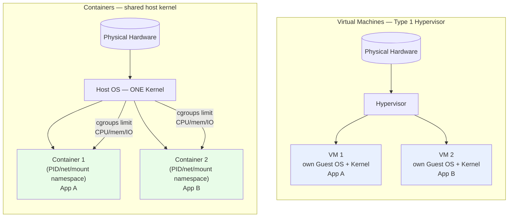
*Each VM brings its own kernel (heavier, stronger isolation); containers share one host kernel and are isolated only by namespaces + cgroups (lighter, faster to start, weaker isolation boundary).*

---

## 16. Security in Operating Systems

**Privilege rings & the kernel/userspace boundary as a security boundary — Definition:** x86 hardware defines four **privilege rings** (0 through 3), though virtually all mainstream OSes use only two in practice — **ring 0** (kernel mode, full hardware access, section 1) and **ring 3** (userspace, restricted) — this ring boundary is a genuine, **hardware-enforced** security mechanism, not merely a software convention — an ordinary userspace process, no matter how it's compromised, cannot directly execute a privileged instruction or access arbitrary physical memory; it can only ever request kernel services through the tightly controlled system-call interface (section 1) — this is precisely why a **privilege escalation** vulnerability (already covered from the attacker's perspective in the Ethical Hacking notes' section 8) is so significant: it represents a flaw letting an attacker cross this fundamental, hardware-enforced boundary they should never otherwise be able to cross.

**Access control models: DAC, MAC, RBAC — Definition:** **DAC (Discretionary Access Control)** — the traditional Unix permission model (CLI notes' section 2) — lets a resource's **owner** decide who else can access it, at their own discretion; **MAC (Mandatory Access Control)** (SELinux, AppArmor) enforces access rules set by a **system-wide security policy**, which even a resource's own owner cannot override — a meaningfully stronger security model specifically because a compromised or misconfigured application still cannot exceed the policy's fixed constraints, unlike DAC where a user/process retains full discretion over their own files' permissions; **RBAC (Role-Based Access Control)** grants permissions based on a user's assigned **role** rather than to each individual user directly — the same RBAC concept already covered concretely for Kubernetes's own access control (Docker-Kubernetes notes, referenced from the Ethical Hacking notes' section 12) — each model trades flexibility for enforcement strength differently, and real systems frequently layer more than one simultaneously (a Linux system commonly running both traditional DAC permissions *and* an additional MAC layer like SELinux on top).

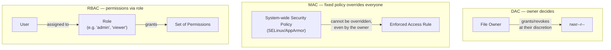

**Common OS-level vulnerabilities (recap Ethical Hacking notes) — Definition:** buffer overflows corrupting kernel or privileged-process memory (C++ notes' section 2, Ethical Hacking notes' section 9's exploit-development discussion, made especially severe when the corrupted code runs in kernel mode rather than merely userspace); TOCTOU (Time-Of-Check-To-Time-Of-Use) race conditions, where a security check and the subsequent privileged action it guards are separated by a window an attacker can exploit to swap out what's actually being acted on in between; and privilege escalation exploits (Ethical Hacking notes' section 8) specifically targeting flaws in the kernel/userspace privilege boundary this section has just described — understanding *why* this boundary exists and precisely how it's enforced (this section) is what makes it possible to actually understand *why* these specific vulnerability classes are so consequential when they succeed.

**Sandboxing & isolation techniques — Definition:** beyond the hardware-enforced ring boundary, modern systems layer additional **sandboxing** — seccomp (Linux, restricting which specific system calls a process is even permitted to invoke at all, directly narrowing its potential attack surface even if fully compromised), browser process sandboxing (a web browser's renderer process, the part directly parsing untrusted, attacker-influenced web content, is deliberately run with drastically reduced OS-level privileges, so that even a successful renderer-process compromise doesn't automatically grant broader system access), and the container isolation already covered in section 15 — each representing the same underlying defense-in-depth philosophy already emphasized generally in the Ethical Hacking notes' section 14, here specifically applied at the operating-system level.

---

## 17. Operating Systems Interview Prep

**Common interview questions** — explain the difference between a process and a thread, and why threads are cheaper to create (sections 2–3); walk through what happens during a context switch and why it's expensive (section 3); explain the four necessary conditions for deadlock, and how you'd prevent it in practice (section 7); what's the difference between paging and segmentation, and why did paging win out (section 5); explain how virtual memory provides isolation between processes (section 6); walk through what a page fault actually is, and why demand paging is beneficial rather than purely an error condition (section 6); explain why a container isn't "a lightweight VM," precisely (section 15); what's the difference between DAC and MAC access control (section 16).

**Linux vs Windows vs macOS kernel architecture — final comparison:**
| | Linux | Windows (NT kernel) | macOS (XNU) |
|---|---|---|---|
| Architecture | Monolithic (with loadable modules) | Hybrid (monolithic core + some modular services) | Hybrid (a Mach microkernel core + a monolithic BSD layer) |
| Filesystem | ext4 (most common) | NTFS | APFS |
| Open source | Fully open source | Proprietary (with some open-sourced components) | Core (XNU) is open source; most of the OS is not |
| Dominant use case | Servers, cloud, embedded, Android's kernel | Desktop, enterprise | Apple's own desktop/laptop hardware |

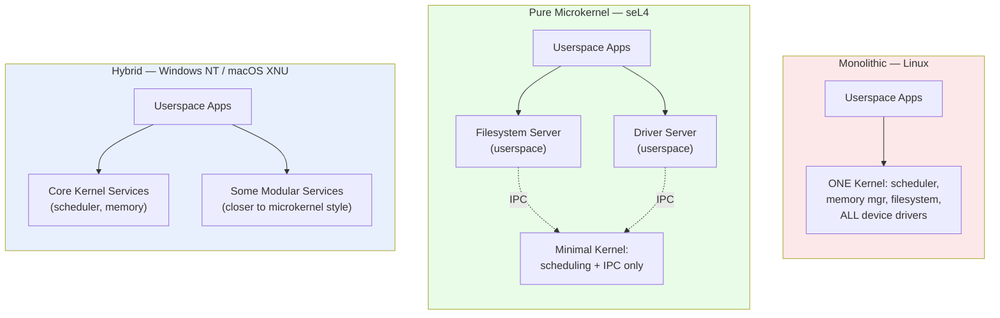
*Monolithic (fastest, one crash can take down the kernel) vs microkernel (isolated services, IPC overhead) vs hybrid (a practical middle ground most real "microkernel-inspired" production systems actually land on).*

**Where Design Patterns show up in OS design — Definition:** direct mappings back to the Design Patterns notes, mirroring the same exercise already done throughout this workspace's other notes files: **the Observer pattern** — interrupt handling (section 9, 13) is a direct, hardware-driven instance of Observer, with the CPU "notifying" the registered handler (via the IDT) the instant a specific event occurs, with no polling required; **the State pattern** — a process's lifecycle (section 2 — new/ready/running/waiting/terminated) is a textbook State-pattern state machine, with well-defined transitions and distinct behavior/handling appropriate to each state; **the Facade pattern** — the entire system-call interface (section 1) is a Facade, presenting a simplified, stable interface over the kernel's vastly more complex internal implementation, letting userspace code remain entirely insulated from internal kernel changes as long as the system-call contract itself remains stable; **the Strategy pattern** — pluggable CPU schedulers (section 4) and pluggable page-replacement algorithms (section 6) are both direct applications of Strategy, letting the underlying algorithm be swapped without changing the surrounding kernel code that invokes it.
